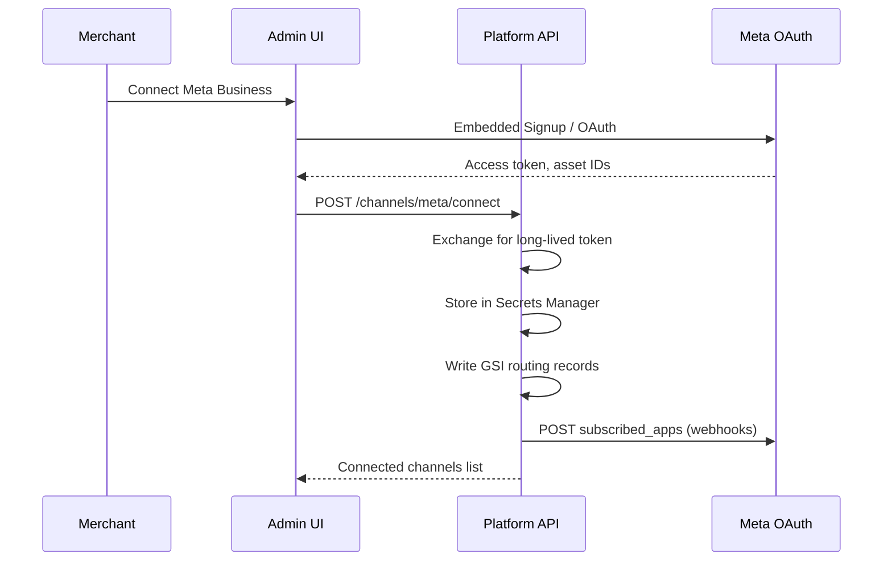

# Function Spec: Meta Channel Integration

**Parent:** [00-MASTER-ARCHITECTURE.md](../00-MASTER-ARCHITECTURE.md)  
**Version:** 1.0  
**Channels:** WhatsApp, Facebook Messenger, Instagram DMs

---

## 1. Purpose

Connect merchant Meta Business assets to the platform, receive inbound messages via webhooks, and send outbound replies through Meta Graph API — with a unified internal message format.

---

## 2. Meta platform overview

All three channels are accessed via **one Meta App** using Graph API v19+ (verify current version at implementation).

| Channel | API surface | Tenant asset |
|---------|-------------|--------------|
| WhatsApp | WhatsApp Cloud API | WABA + `phone_number_id` |
| Messenger | Messenger Platform | Facebook Page `page_id` |
| Instagram | Instagram Messaging | IG Professional `ig_id` linked to Page |

---

## 3. Onboarding (merchant connects channels)

### Flow



### Stored credentials (per tenant, Secrets Manager)

```json
{
  "metaPageAccessToken": "<long-lived-page-token>",
  "pageId": "123456789",
  "igUserId": "987654321",
  "wabaId": "111222333",
  "phoneNumberId": "444555666",
  "tokenExpiresAt": "2026-12-01T00:00:00Z"
}
```

### Required Meta permissions (App Review)

| Permission | Channel |
|------------|---------|
| `whatsapp_business_messaging` | WhatsApp |
| `whatsapp_business_management` | WhatsApp setup |
| `pages_show_list` | Messenger (list Pages during OAuth) |
| `pages_messaging` | Messenger send/receive |
| `pages_manage_metadata` | Webhook subscription |
| `instagram_manage_messages` | Instagram DMs |
| `business_management` | Embedded Signup |

---

## 4. Webhook receiver

### Endpoint

```
GET  /webhooks/meta   → verification challenge (hub.verify_token)
POST /webhooks/meta   → inbound events
```

### Verification (GET)

| Param | Handling |
|-------|----------|
| `hub.mode` | Must be `subscribe` |
| `hub.verify_token` | Match app config in SSM |
| `hub.challenge` | Return challenge as plain text 200 |

### Security (POST)

1. Read raw body (required for signature)
2. Verify `X-Hub-Signature-256` = `sha256=<hmac(app_secret, body)>`
3. Reject if invalid → 403
4. Parse JSON; handle multiple `entry[]` per payload
5. For each messaging event → resolve tenant → enqueue SQS
6. Return `200 OK` immediately (target < 200ms)

### Tenant resolution

| Event field | Lookup GSI |
|-------------|------------|
| `entry[].changes[].value.metadata.phone_number_id` | `PHONE#<id>` |
| `entry[].id` (Page ID) | `PAGE#<id>` |
| `entry[].messaging[].recipient.id` (IG) | `IG#<id>` |

---

## 5. Unified message contract

```typescript
interface UnifiedMessage {
  messageId: string;           // platform-generated UUID
  tenantId: string;
  channel: "whatsapp" | "messenger" | "instagram";
  conversationId: string;
  externalUserId: string;      // wa_id | psid | ig_scoped_id
  direction: "inbound" | "outbound";
  type: "text" | "image" | "audio" | "video" | "document" | "location" | "interactive" | "template";
  text?: string;
  mediaId?: string;            // Meta media ID (fetch via Graph API)
  mediaUrl?: string;           // resolved URL (cached in S3)
  replyToMessageId?: string;
  timestamp: string;           // ISO 8601
  raw: object;                 // original webhook payload (S3 ref for large)
}
```

---

## 6. Inbound parsing by channel

### WhatsApp

| Webhook field | Maps to |
|---------------|---------|
| `messages[].from` | `externalUserId` |
| `messages[].type` | `type` |
| `messages[].text.body` | `text` |
| `messages[].image.id` | `mediaId` |
| `messages[].interactive.*` | `type: interactive` |

### Messenger

| Webhook field | Maps to |
|---------------|---------|
| `sender.id` | `externalUserId` (PSID) |
| `message.text` | `text` |
| `message.attachments[]` | `type` + `mediaUrl` |
| `postback.payload` | `type: interactive` |

### Instagram

| Webhook field | Maps to |
|---------------|---------|
| `sender.id` | `externalUserId` |
| `message.text` | `text` |
| `message.attachments` | media types (limited vs Messenger) |

---

## 7. Outbound sending

### SQS queue: `outbound-messages`

Consumer Lambda: `channel-sender-meta`

| Step | Action |
|------|--------|
| 1 | Load tenant Meta credentials from Secrets Manager |
| 2 | Check messaging policy (24h window) |
| 3 | Split long text per channel limits |
| 4 | Format channel-specific payload |
| 5 | POST Graph API send endpoint |
| 6 | Log message ID; handle errors with retry |

### Send endpoints

| Channel | Endpoint |
|---------|----------|
| WhatsApp | `POST /<phone_number_id>/messages` |
| Messenger | `POST /me/messages` (with `page_access_token`) |
| Instagram | `POST /me/messages` (IG messaging via Page token) |

### Message length limits

| Channel | Text limit | Notes |
|---------|------------|-------|
| WhatsApp | 4096 chars | Split into multiple messages |
| Messenger | 2000 chars | Split or use generic template |
| Instagram | 1000 chars | More aggressive splitting |

---

## 8. Messaging policy service

```typescript
interface MessagingPolicy {
  canSendFreeForm(conversation: Conversation): boolean;
  requiresTemplate(conversation: Conversation): boolean;
  getApprovedTemplates(tenantId: string): Template[];
}
```

### 24-hour session window

| Channel | Window starts | Free-form allowed |
|---------|---------------|-------------------|
| WhatsApp | Last inbound customer message | 24 hours |
| Messenger | Last inbound customer message | 24 hours |
| Instagram | Last inbound customer message | 24 hours |

**Outside window:** Send only approved WhatsApp templates or platform-specific re-engagement flows. Log `TEMPLATE_REQUIRED` and notify merchant in admin.

---

## 9. SQS message format

### Inbound queue

```json
{
  "tenantId": "ten_abc123",
  "channel": "whatsapp",
  "unifiedMessage": { },
  "receivedAt": "2026-06-06T12:00:00Z",
  "idempotencyKey": "wa_<message_id>"
}
```

**Idempotency:** DynamoDB conditional write on `idempotencyKey` — skip duplicates (Meta retries webhooks).

### Outbound queue

```json
{
  "tenantId": "ten_abc123",
  "channel": "whatsapp",
  "conversationId": "conv_xyz",
  "messages": [
    { "type": "text", "text": "Here are 3 blue sneakers in your size..." }
  ],
  "correlationId": "orch_123"
}
```

---

## 10. Media handling

| Step | Service |
|------|---------|
| Receive media ID from webhook | Orchestrator |
| Fetch media URL from Graph API | `media-fetcher` Lambda |
| Download and store | S3 `/<tenantId>/media/<id>` |
| Pass to LLM (vision) | Optional Phase 2 — GPT-4o vision |
| Virus scan | Optional — S3 trigger + ClamAV Lambda |

---

## 11. Error handling and retries

| Error | Action |
|-------|--------|
| Graph API 429 | Exponential backoff; SQS visibility timeout |
| Graph API 401 | Mark channel `token_expired`; notify merchant |
| Graph API 400 (policy) | Log; send template fallback if available |
| Invalid signature | 403; alert ops |
| Unknown tenant | 200 OK (prevent Meta retry storm); log error |

### DLQ processing

- Alert via SNS
- Admin replay tool (Phase 2)
- Max receive count: 3

---

## 12. Lambda functions

| Function | Trigger | Responsibility |
|----------|---------|----------------|
| `webhook-meta-receiver` | API Gateway | Verify, route, enqueue |
| `channel-sender-meta` | SQS outbound | Send via Graph API |
| `meta-token-refresh` | EventBridge daily | Refresh expiring tokens |
| `meta-connect` | API Gateway | Onboarding OAuth callback |
| `media-fetcher` | Internal invoke | Download Meta media |

---

## 13. APIs (admin)

| Method | Path | Description |
|--------|------|-------------|
| POST | `/api/v1/channels/meta/connect` | WhatsApp OAuth; store credentials |
| POST | `/api/v1/channels/meta/connect-messenger` | Messenger OAuth; store Page token |
| POST | `/api/v1/channels/meta/connect-dev` | Dev WhatsApp connect (env tokens) |
| POST | `/api/v1/channels/meta/connect-messenger-dev` | Dev Messenger connect (env Page token) |
| GET | `/api/v1/channels/meta/health` | Connection health per channel |
| DELETE | `/api/v1/channels/meta/{channel}` | Disconnect WhatsApp or Messenger |
| GET | `/api/v1/channels/meta/templates` | List WhatsApp templates (planned) |

---

## 14. Testing checklist

- [ ] Webhook verification handshake
- [ ] Signature validation rejects tampered payloads
- [ ] WhatsApp inbound text → SQS → correct tenant
- [ ] Messenger inbound → correct tenant via page_id
- [ ] Instagram inbound → correct tenant via ig_id
- [ ] Duplicate webhook → idempotent skip
- [ ] Outbound send inside 24h window
- [ ] Outside window → template path triggered
- [ ] Token expiry → merchant notification
- [ ] Long message splitting per channel

---

## 15. Local implementation notes (2026-06-11)

### Messenger connect flow (shipped)

1. Admin **Channels** → **Connect Messenger** → Meta OAuth with scopes:  
   `pages_show_list`, `pages_messaging`, `pages_manage_metadata`, `business_management`
2. `POST /api/v1/channels/meta/connect-messenger` exchanges code, lists Pages, stores Page access token
3. Multi-Page accounts return `needsPageSelection` for the merchant to pick a Page
4. Credentials: local `.data/meta/{tenantId}-messenger.json`; production → Secrets Manager (planned)
5. Routing: `PAGE#<pageId>` GSI maps inbound webhooks to tenant
6. On connect: `POST /{pageId}/subscribed_apps` with `messages,messaging_postbacks`

### Webhook (local dev)

| Item | Value |
|------|-------|
| Public URL | `https://<ngrok>.ngrok-free.dev/webhooks/meta` |
| ngrok target | Admin `:3000` (Next.js rewrites `/webhooks/*` → API `:3001`) |
| Handler | `apps/api/src/handlers/webhook-meta.ts` |
| Inbound | `parseMessengerWebhookPayload` → `processMessengerInbound` → chat orchestrator → `sendMessengerText` |

**Critical:** In Meta Developer Console → Webhooks, subscribe the **Page** object to `messages` and `messaging_postbacks`. A Page callback without these fields will not deliver Messenger DMs (WhatsApp WABA fields are separate).

### Health check

Messenger health uses Meta `debug_token` on the stored Page access token plus the saved `pageName`. Do **not** call `GET /{pageId}` or `GET /me?fields=name` — those require `pages_read_engagement`, which is not needed for messaging.

### OAuth redirect

Must be HTTPS in dev. Open admin via ngrok and whitelist:  
`https://<ngrok>.ngrok-free.dev/channels/meta/callback`

Set `META_OAUTH_REDIRECT_URI` or `NEXT_PUBLIC_META_OAUTH_REDIRECT_URI` to match exactly.

### Dev connect (no OAuth)

Set `META_DEV_PAGE_ID`, `META_DEV_PAGE_ACCESS_TOKEN`, optional `META_DEV_PAGE_NAME` in `apps/api/.env`, then use **Connect Messenger (dev)** on the Channels page.
