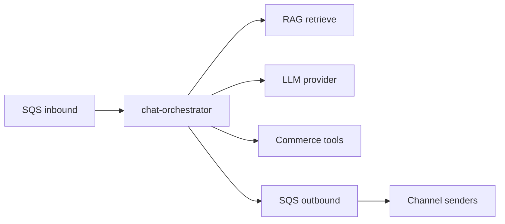
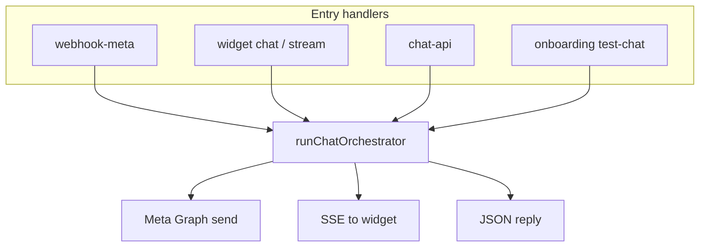
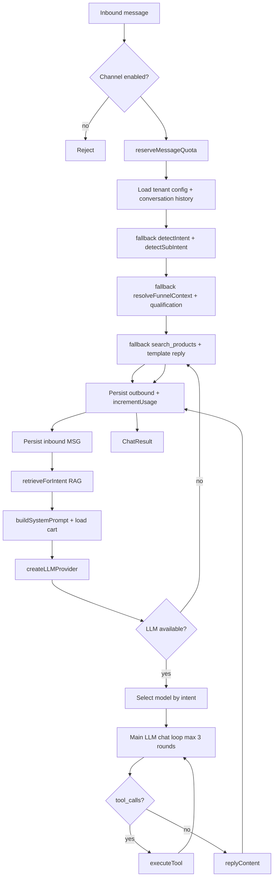
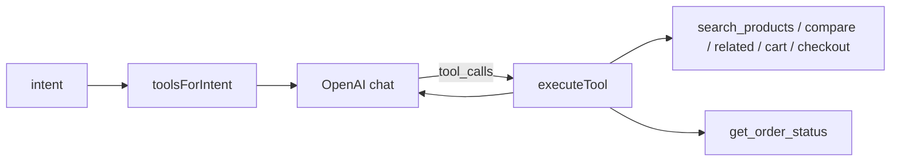

# Function Spec: Chat Orchestration

**Parent:** [00-MASTER-ARCHITECTURE.md](../00-MASTER-ARCHITECTURE.md)  
**Version:** 1.3  
**Implementation:** `packages/core/src/chat/orchestrator.ts`  
**Related:** [07-chat-quality-roadmap.md](../implementation/07-chat-quality-roadmap.md) (funnel, sub-intents, CTAs, sales planner)

---

## 1. Purpose

Process every inbound customer message end-to-end: session management, intent detection, sales planning, RAG retrieval, LLM invocation, tool execution, and outbound reply — channel-agnostic.

---

## 2. Position in pipeline

### Target (SQS-driven)



### Shipped (sync Lambda, same core library)



| Caller | File |
|--------|------|
| Web widget | `packages/core/src/widget/service.ts` |
| Admin test chat | `packages/core/src/chat/service.ts` |
| WhatsApp | `packages/core/src/meta/process-inbound.ts` |
| Messenger | `packages/core/src/meta/process-messenger-inbound.ts` |
| Instagram | `packages/core/src/meta/process-instagram-inbound.ts` |

---

## 3. Orchestrator algorithm



Numbered steps (spec):

```
1.  Validate message; check channel + quota
2.  Load tenant config (DynamoDB CONFIG + PROFILE)
3.  Check tenant status (active/trial only) — assertTenantOperational
4.  reserveMessageQuota (atomic; 80% warning email after success)
5.  Resolve conversationId from externalUserId + channel
6.  Persist inbound message to DynamoDB
7.  Load conversation history + cart
8.  Compute fallback intent/sub-intent/funnel using deterministic rules
9.  Load catalog hints for the planner
10. Run the LLM chat planner JSON call (`sales-planner.ts`)
11. Use trusted planner values as primary intent, sub-intent, funnel stage, action, gate, query, and tool policy
12. Merge deterministic qualification with trusted, grounded planner slots
13. Retrieve RAG context using planner `ragQuery` or search query when trusted
14. Persist inbound message with planner-derived route metadata
15. Build main LLM messages array (system + history + user + funnel hints)
16. Call LLM via `createLLMProvider` (model per intent from tenant `llmConfig`)
17. If `tool_calls` → execute tools → loop (max 3 rounds)
18. Build `suggestedActions` (CTAs) for web channel
19. Fallback reply if no LLM or empty response
20. Persist outbound message(s) to DynamoDB (with `funnelStage`, `subIntent`)
21. Increment usage counters (messages, tokens, including planner call)
22. Return reply to channel handler (Meta send / widget SSE / JSON)
```

---

## 4. Conversation model

### DynamoDB

| PK | SK | Attributes |
|----|-----|------------|
| `TENANT#<id>` | `CONV#<channel>#<externalUserId>` | conversationId, cartId, funnelStage, qualification, lastInboundAt, lastOutboundAt, status |
| `TENANT#<id>` | `MSG#<conversationId>#<timestamp>` | role, content, channel, tokenCount |

### Conversation state object

```json
{
  "conversationId": "conv_abc",
  "tenantId": "ten_123",
  "channel": "whatsapp",
  "externalUserId": "919876543210",
  "cartId": "cart_xyz",
  "funnelStage": "discover",
  "qualification": {
    "budget": "under_50",
    "category": "sneakers",
    "recipient": null,
    "objections": []
  },
  "status": "active",
  "lastInboundAt": "2026-06-06T12:00:00Z",
  "messageCount": 14,
  "metadata": {
    "customerName": "Priya",
    "locale": "en"
  }
}
```

---

## 5. Intent detection

### Current approach

The LLM planner is now the primary router for intent, sub-intent, funnel stage, and next action. Rule-based classifiers in `intent.ts`, `funnel.ts`, `discover-gate.ts`, and `conversation-policy.ts` remain as fallback inputs only when planner JSON is missing, low-confidence, or invalid.

| Signal | Intent |
|--------|--------|
| Keywords: ship, return, refund, policy, hours | `faq` |
| Keywords: buy, price, size, color, recommend, product | `product` |
| Keywords: cart, checkout, order, pay, purchase | `checkout` |
| First message in session | `greeting` |
| Default | `product` |

### Fallback rules

Sub-intents refine product/checkout turns (`packages/core/src/chat/intent.ts`):

| Sub-intent | Typical signals |
|------------|-----------------|
| `product_browse` | open-ended search, gifts, recommendations |
| `product_compare` | vs, difference, which is better |
| `product_detail` | specific SKU, specs, sizing |
| `objection_price` / `objection_shipping` / … | cost, delivery, returns concerns |

Funnel stage (`packages/core/src/chat/funnel.ts`) advances from conversation + cart state:

| Stage | Meaning |
|-------|---------|
| `discover` | browsing, qualifying |
| `compare` | comparing options |
| `objection` | handling concerns |
| `cart` | items in cart |
| `checkout` | checkout link / order status |

### LLM planner layer (primary)

For every bot-handled turn, `runSalesPlanner()` performs a low-temperature JSON LLM call before the main reply call. It does not answer the shopper directly. It extracts the route and next move:

```typescript
{
  confidence,
  languageStyle,
  intent,
  subIntent,
  funnelStage,
  action,
  gateProductSearch,
  searchQuery,
  ragQuery,
  toolPolicy,
  missingSlot,
  resetContext,
  productType,
  material,
  occasion,
  recipient,
  useCase,
  style,
  quantity,
  budget,
  availabilityQuestion,
  nextQuestion,
  replyTone,
  suggestedActions,
  recoveryActions
}
```

Planner output is used only when trusted and normalized. Slot values are persisted only when grounded in the latest user message, existing state, or tenant catalog aliases. Planner `nextQuestion` and `suggestedActions` are authoritative for engagement on trusted turns; deterministic engagement runs only as fallback. This prevents stale context such as old recipient/style/budget filters from leaking into a new request like `show me silver elephant`.

---

## 6. Context assembly

### History window

| Setting | Default | Max |
|---------|---------|-----|
| Messages in context | Last 10 turns | 20 |
| Max history tokens | 2000 | 4000 |

### RAG injection

```
[Chat planner JSON call: latest message + recent history + existing qualification + cart count + page URL + catalog hints + fallback route]
[Main system prompt + store config]
[Retrieved chunks — max 5, ~500 tokens each]
[Conversation history]
[Current user message]
```

### Source priority by intent

| Intent | Primary sources | Fallback |
|--------|-----------------|----------|
| `faq` | website | conversation |
| `product` | catalog, website | social |
| `checkout` | catalog | website (shipping) |
| `greeting` | — (use prompts only) | — |

---

## 6a. LLM call structure and prompt locations

### Chat planner call

**Prompt location:** `packages/core/src/chat/sales-planner.ts` in `runSalesPlanner()`.

Shape:

```typescript
await llm.chat({
  model,
  temperature: 0.1,
  maxOutputTokens: 350,
  messages: [
    { role: "system", content: "You are a multilingual ecommerce chat router and sales planning module..." },
    {
      role: "user",
      content: JSON.stringify({
        latestMessage,
        recentHistory,
        existingQualification,
        catalogHints,
        fallback,
        cartItemCount,
        pageUrl,
      }),
    },
  ],
});
```

The response is normalized, validated, and exposed as `salesPlan` in chat responses/evals.

### Main chat call

**Prompt location:** `packages/core/src/chat/prompts.ts` in `buildSystemPrompt()`. The tenant base prompt is `config.prompts.systemPrompt`.

**Call location:** `packages/core/src/chat/orchestrator.ts`.

Shape:

```typescript
const messages = [
  { role: "system", content: systemPrompt },
  ...historyToChatMessages(history),
  { role: "user", content: text },
];

await llm.chat({
  model,
  messages,
  tools,
  temperature,
  maxOutputTokens,
});
```

If the LLM returns tool calls, the orchestrator appends assistant/tool messages and repeats the main chat call up to `MAX_TOOL_ROUNDS`.

---

## 7. Tool execution loop



| Rule | Value |
|------|-------|
| Max tool rounds per message | 3 |
| Timeout per tool | 5s (implicit via Lambda) |
| Parallel tool calls | Sequential in loop (LLM may request multiple per round) |

**Code:** `packages/core/src/chat/tools.ts` — `TOOL_DEFINITIONS`, `toolsForIntent()`, `executeTool()`.

### Available tools

See [06-ecommerce-tools.md](06-ecommerce-tools.md) for full specs.

| Tool | When exposed |
|------|--------------|
| `search_products` | intent = product, checkout |
| `get_product_details` | intent = product, checkout |
| `compare_products` | sub-intent = product_compare |
| `get_related_products` | intent = product (post-search / upsell) |
| `add_to_cart` | intent = product, checkout |
| `get_cart` | intent = checkout |
| `create_checkout_link` | intent = checkout |
| `get_order_status` | intent = checkout, faq |

---

## 8. Response formatting

### Social channels

- Plain text primary
- Optional: WhatsApp interactive list (product options)
- Optional: quick replies (Messenger)
- No markdown (strip `**`, `#`, links → plain URL)

### Web channel

- Markdown supported
- Product cards (JSON → widget renders)
- `suggestedActions` with `action`: `view` | `add_to_cart` | `checkout`
- Widget `add_to_cart` calls `POST /api/v1/widget/cart` directly (no chat round-trip)
- Streaming via SSE

### Response splitter

```typescript
function splitForChannel(text: string, channel: Channel): string[] {
  const limits = { whatsapp: 4096, messenger: 2000, instagram: 1000, web: 16000 };
  // Split on paragraph boundaries; never mid-word
}
```

---

## 9. System prompt template

```
You are {{storeName}}'s AI shopping assistant.

Rules:
- Answer using ONLY the provided context and tool results
- For shipping, returns, and policies: prefer website sources
- Be friendly and match the brand tone in social/conversation examples
- When recommending products, use search_products tool — do not invent SKUs
- Confirm before adding to cart
- If unsure, ask a clarifying question
- Never share other customers' information

Context:
{{ragChunks}}

Current cart: {{cartSummary}}
```

---

## 10. Latency budget

| Step | Target p95 |
|------|------------|
| Load session + config | 50ms |
| RAG retrieval | 200ms |
| LLM call (1 round) | 3000ms |
| Tool execution | 500ms |
| Persist + enqueue | 100ms |
| **Total** | **< 5000ms** (social) |

---

## 11. Lambda specification

| Property | Value |
|----------|-------|
| Name | `chat-orchestrator` |
| Trigger | SQS `inbound-messages` |
| Memory | 1024 MB |
| Timeout | 60s |
| Concurrency | Reserved: 50 (scale per load) |
| Batch size | 1 (ordering per conversation) |

**FIFO consideration:** Use `MessageGroupId = tenantId#conversationId` on SQS FIFO queue to preserve message order per conversation.

---

## 12. Failure modes

| Failure | Behavior |
|---------|----------|
| LLM timeout | Retry once on fallback provider; then apology message |
| RAG empty | Proceed with tools + system prompt; log warning |
| Tool failure | LLM receives error; responds gracefully |
| Quota exceeded | "We've reached our message limit. Please contact the store directly." |
| Tenant suspended | No orchestration (filtered at webhook) |

---

## 13. Observability

### Structured log fields

```json
{
  "tenantId": "ten_123",
  "conversationId": "conv_abc",
  "channel": "whatsapp",
  "intent": "product",
  "subIntent": "product_browse",
  "funnelStage": "discover",
  "llmProvider": "openai",
  "llmModel": "gpt-4o-mini",
  "inputTokens": 2100,
  "outputTokens": 280,
  "ragChunkCount": 4,
  "toolCalls": ["search_products"],
  "latencyMs": 4200
}
```

### Metrics (CloudWatch)

- `MessagesProcessed` per tenant, channel
- `OrchestratorLatency` p50/p95/p99
- `LLMErrorRate` per provider
- `ToolFailureRate` per tool name

---

## 14. APIs (internal)

Orchestrator core is **`runChatOrchestrator()`** in `packages/core/src/chat/orchestrator.ts`. Invoked synchronously from channel handlers today.

| Lambda | Path | Mode |
|--------|------|------|
| `chat-api` | `POST /api/v1/chat` | Sync JSON |
| `widget` | `POST /api/v1/widget/chat` | Sync JSON |
| `widget` | `POST /api/v1/widget/chat/stream` | Sync + SSE events |
| `webhook-meta` | `POST /webhooks/meta` | Sync; orchestrate + Meta Graph send |
| `onboarding` | `POST /api/v1/onboarding/test-chat` | Sync test simulator |

---

## 15. Testing checklist

- [ ] New conversation created on first message
- [ ] History persists across messages
- [ ] Intent routing selects correct LLM model
- [ ] RAG chunks match intent source filters
- [ ] Tool loop terminates at 3 rounds
- [ ] Outbound message enqueued with correct channel format
- [ ] Quota enforcement blocks over-limit tenants
- [ ] Fallback LLM used when primary fails
- [ ] Message order preserved per conversation (FIFO)
