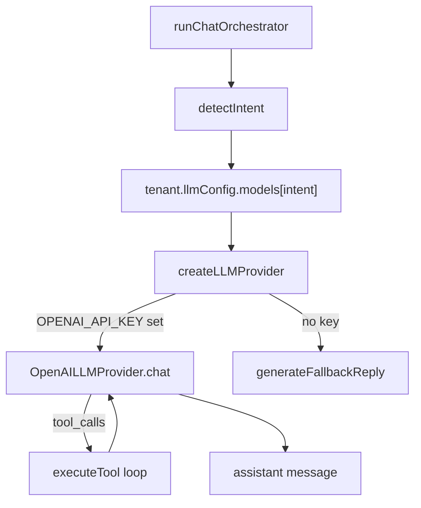

# Function Spec: LLM Provider Router

**Parent:** [00-MASTER-ARCHITECTURE.md](../00-MASTER-ARCHITECTURE.md)  
**Version:** 1.1  
**Implementation:** `packages/core/src/llm/` · wired from `packages/core/src/chat/orchestrator.ts`

---

## 1. Purpose

Abstract LLM and embedding providers behind a unified interface so the platform can switch between **OpenAI** (primary) and **Amazon Bedrock** (fallback) without changing orchestration or tool logic.

### Shipped vs planned

| Feature | Status |
|---------|--------|
| OpenAI `chat/completions` + tools | **Shipped** — `OpenAILLMProvider` |
| Model per intent (`faq` / `product` / `checkout`) | **Shipped** — tenant `llmConfig.models` |
| Bedrock fallback adapter | Planned |
| `chatStream` for widget | Planned (widget uses SSE events around sync chat today) |
| Embedding provider | **Shipped** — `createEmbeddingProvider` in ingest |



**Code map:**

| Module | Role |
|--------|------|
| `llm/provider.ts` | `createLLMProvider()` — OpenAI if `OPENAI_API_KEY` |
| `llm/openai.ts` | HTTP adapter, retries, tool call mapping |
| `llm/types.ts` | `LLMProvider`, `ChatRequest`, `ChatResponse` |
| `chat/orchestrator.ts` | Model selection + tool loop |

---

## 2. Design principles

1. **One interface, multiple adapters**
2. **Config-driven routing** per tenant and intent
3. **Embeddings are not switchable** without re-index (fixed per tenant)
4. **Explicit fallback** on provider errors only — not silent mid-conversation downgrade
5. **Log every call** with provider, model, tokens, latency

---

## 3. Provider interface

```typescript
interface LLMProvider {
  readonly name: "openai" | "bedrock" | "anthropic";

  chat(request: ChatRequest): Promise<ChatResponse>;
  chatStream(request: ChatRequest): AsyncIterable<ChatChunk>;

  supportsTools(): boolean;
  supportsStreaming(): boolean;
  maxContextTokens(model: string): number;
}

interface ChatRequest {
  model: string;
  messages: Message[];
  tools?: ToolDefinition[];
  temperature?: number;
  maxOutputTokens?: number;
  responseFormat?: "text" | "json";
}

interface ChatResponse {
  content: string;
  toolCalls?: ToolCall[];
  usage: { inputTokens: number; outputTokens: number };
  finishReason: string;
  provider: string;
  model: string;
  latencyMs: number;
}
```

---

## 4. Supported models (v1)

### OpenAI adapter

| Internal key | API model | Input $/1M | Output $/1M | Use |
|--------------|-----------|------------|-------------|-----|
| `gpt-4.1-nano` | gpt-4.1-nano | $0.10 | $0.40 | FAQ |
| `gpt-4o-mini` | gpt-4o-mini-2024-07-18 | $0.15 | $0.60 | Product |
| `gpt-4.1-mini` | gpt-4.1-mini | $0.40 | $1.60 | Checkout |

### Bedrock adapter (fallback)

| Internal key | Bedrock model ID | Use |
|--------------|------------------|-----|
| `nova-micro` | amazon.nova-micro-v1:0 | FAQ fallback |
| `claude-3-haiku` | anthropic.claude-3-haiku-20240307-v1:0 | General fallback |
| `claude-3-5-haiku` | anthropic.claude-3-5-haiku-20241022-v1:0 | Premium fallback |

### Embedding (separate from chat router)

| Provider | Model | Dimensions | Cost |
|----------|-------|------------|------|
| OpenAI | text-embedding-3-small | 1536 (truncate to 1024 optional) | $0.02/1M |
| OpenAI | text-embedding-3-large | 1024 (truncated via MRL) | $0.13/1M |

**Default for all tenants:** `text-embedding-3-small`

---

## 5. Router logic

```typescript
function resolveProvider(tenant: TenantConfig, intent: Intent): RouteDecision {
  const route = tenant.llmConfig.models[intent];
  return {
    primary: { provider: tenant.llmConfig.primaryProvider, model: route },
    fallback: { provider: tenant.llmConfig.fallbackProvider, model: mapFallback(route) }
  };
}
```

### Fallback mapping

| Primary model | Fallback model |
|---------------|----------------|
| gpt-4.1-nano | nova-micro |
| gpt-4o-mini | claude-3-haiku |
| gpt-4.1-mini | claude-3-5-haiku |

### Retry policy

| Condition | Action |
|-----------|--------|
| 429 rate limit | Exponential backoff × 2, then fallback |
| 500/502/503 | Immediate fallback |
| 400 bad request | No fallback; log and return error |
| Timeout (> 25s) | Fallback |
| Context length exceeded | Truncate history; retry once; then fallback |

---

## 6. Adapter implementation notes

### OpenAI adapter

| Item | Detail |
|------|--------|
| SDK | `openai` npm package |
| Auth | API key from Secrets Manager (`/commercechat/platform/openai`) |
| Tools | OpenAI function calling format |
| Streaming | `stream: true` for web channel only |
| Caching | Enable prompt caching for system prompt (stable prefix) |

### Bedrock adapter

| Item | Detail |
|------|--------|
| SDK | `@aws-sdk/client-bedrock-runtime` |
| Auth | Lambda IAM role |
| Tools | Converse API toolConfig |
| Region | Same as deployment (us-east-1) |
| Streaming | ConverseStream for web channel |

### Tool call normalization

All adapters must return:

```json
{
  "toolCalls": [
    {
      "id": "call_abc",
      "name": "search_products",
      "arguments": { "query": "blue sneakers size 9" }
    }
  ]
}
```

Adapters parse provider-specific formats internally.

---

## 7. Credential management

| Secret path | Contents |
|-------------|----------|
| `/commercechat/platform/openai` | Platform-wide OpenAI API key |
| `/commercechat/platform/bedrock` | IAM role (no secret; role-based) |

**Phase 3:** Per-tenant OpenAI keys for enterprise (BYOK).

---

## 8. Cost tracking

Every `ChatResponse` writes to usage record:

```json
{
  "tenantId": "ten_123",
  "period": "2026-06",
  "provider": "openai",
  "model": "gpt-4o-mini",
  "inputTokens": 2100,
  "outputTokens": 280,
  "estimatedCostUsd": 0.000483
}
```

### Cost formula (stored in config)

```typescript
const cost = (inputTokens / 1e6) * inputPrice + (outputTokens / 1e6) * outputPrice;
```

Price table in SSM Parameter Store; update without redeploy.

---

## 9. Configuration API

Merchants can override (admin dashboard):

| Field | Allowed values | Plan gate |
|-------|----------------|-----------|
| `primaryProvider` | openai, bedrock | Pro+ for bedrock-primary |
| `models.faq` | Model list | Starter: nano/mini only |
| `models.checkout` | Model list | Pro+ for gpt-4.1-mini |

Validation Lambda rejects disallowed combinations per plan.

---

## 10. What NOT to abstract

| Feature | Handling |
|---------|----------|
| Bedrock Knowledge Bases | Not used; custom RAG pipeline |
| OpenAI Assistants API | Not used; custom orchestrator |
| Provider-specific web search | Out of scope v1 |
| Fine-tuned models | Phase 3 enterprise |

---

## 11. Module structure

```
src/
  llm/
    types.ts           # Interfaces
    router.ts          # Route + retry + fallback
    adapters/
      openai.ts
      bedrock.ts
    pricing.ts         # Token cost calculation
    tools.ts           # Tool schema (shared JSON Schema)
```

---

## 12. Testing checklist

- [ ] OpenAI adapter: chat + tools + streaming
- [ ] Bedrock adapter: converse + tools
- [ ] Router selects model by intent
- [ ] Fallback triggers on 503
- [ ] No fallback on 400
- [ ] Tool call format identical across providers
- [ ] Token usage recorded per call
- [ ] Cost estimate matches pricing table
- [ ] Tenant config override respected
