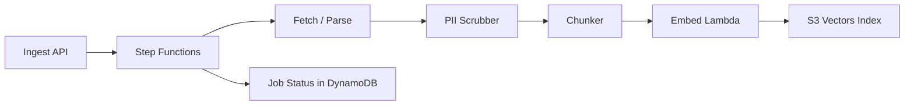

# Function Spec: RAG & Knowledge Ingestion

**Parent:** [00-MASTER-ARCHITECTURE.md](../00-MASTER-ARCHITECTURE.md)  
**Version:** 1.0

---

## 1. Purpose

Ingest merchant knowledge from websites, social content, conversation exports, and product catalogs; chunk, embed, and index into per-tenant S3 Vectors for retrieval during chat.

### Implementation status (AWS dev, 2026-06-15)

| Component | Shipped | Notes |
|-----------|---------|-------|
| Vector store | `S3VectorStore` | Bucket `commercechat-{env}-vectors`; per-tenant index `tenant-{id}` |
| Async ingest | Step Functions + SQS | `commercechat-dev-ingest` → `ingest-worker` Lambda |
| Catalog CSV | Data S3 bucket | `S3_DATA_BUCKET/catalog/{tenantId}/{sourceId}.csv` (shared across Lambdas) |
| FAQ | Sync on POST | `POST /api/v1/knowledge/faq` embeds inline (no job queue) |
| Website crawl | Local + AWS | Crawl output still local `/tmp` on AWS — **persist to data S3 next** |
| Verify | `test-s3-vectors-ingest.mjs` | FAQ + catalog pipeline; 5/5 on dev |

---

## 2. Supported sources

| Source | Input method | Phase |
|--------|--------------|-------|
| Website | URL crawl | MVP |
| Product catalog | CSV upload / API sync | MVP (CSV), Phase 3 (Shopify) |
| Conversation export | File upload (JSON/CSV/ZIP) | Phase 2 |
| Social content | OAuth API + manual upload | Phase 2 |
| FAQ manual entry | Admin form | MVP |

---

## 3. Ingestion pipeline



### Step Functions states

```
ValidateInput → FetchContent → ParseContent → ScrubPII → ChunkContent
  → EmbedChunks → IndexVectors → UpdateJobStatus → NotifyComplete
```

On failure at any step → `UpdateJobFailed` → SNS alert + admin error message.

---

## 4. Source-specific processing

### 4.1 Website crawl

| Setting | Default |
|---------|---------|
| Max depth | 3 |
| Max pages | 500 |
| Respect robots.txt | Yes |
| Crawl frequency | Weekly (EventBridge Scheduler) |
| User-Agent | `CommerceChatBot/1.0 (+https://yoursite.com/bot)` |

**Chunking:** Split on H2/H3 headings; max 800 tokens per chunk; overlap 100 tokens.

**Metadata per chunk:**
```json
{
  "source_type": "website",
  "url": "https://store.com/shipping",
  "title": "Shipping Policy",
  "section": "International Shipping",
  "crawled_at": "2026-06-06T00:00:00Z"
}
```

### 4.2 Product catalog (CSV)

| Required columns | `sku`, `name`, `description`, `price`, `category` |
| Optional | `image_url`, `sizes`, `colors`, `stock`, `url` |

**Chunking:** One chunk per product; embed concatenation:
```
{name} | {category} | {description} | ${price} | SKU: {sku} | Sizes: {sizes}
```

**Metadata:**
```json
{
  "source_type": "catalog",
  "sku": "SHOE-BLU-9",
  "price": 89.99,
  "category": "Sneakers",
  "in_stock": true
}
```

### 4.3 Conversation export

**Supported formats:**
- Meta/WhatsApp export JSON
- Generic CSV: `question,answer` or `role,content,timestamp`
- ZIP containing multiple JSON files

**Chunking (critical):** Pair Q+A into single chunk:
```
Customer: {question}
Assistant: {answer}
```

**Metadata:**
```json
{
  "source_type": "conversation",
  "platform": "whatsapp",
  "date": "2025-11-15",
  "topic": "returns"
}
```

### 4.4 Social content

| Method | Content |
|--------|---------|
| Manual upload | CSV/JSON of captions + post dates |
| OAuth API (Phase 2) | Recent public posts via Meta Graph API |

**Metadata:**
```json
{
  "source_type": "social",
  "platform": "instagram",
  "post_id": "123",
  "posted_at": "2026-01-10"
}
```

**Retrieval weight:** Lower priority than website for policy questions.

### 4.5 Manual FAQ

Admin form entries stored directly as chunks:

```json
{
  "source_type": "faq",
  "question": "Do you ship internationally?",
  "answer": "Yes, we ship to 40+ countries..."
}
```

---

## 5. PII scrubbing

Run before embedding on conversation and social sources.

| Pattern | Action |
|---------|--------|
| Email addresses | Replace with `[EMAIL]` |
| Phone numbers | Replace with `[PHONE]` |
| Credit card numbers | Replace with `[CARD]` |
| Names (NER — Phase 2) | Replace with `[NAME]` |

Lambda: `pii-scrubber` using regex (MVP) + Amazon Comprehend (Phase 2).

---

## 6. Embeddings

| Setting | Value |
|---------|-------|
| Model | `text-embedding-3-small` |
| Dimensions stored | 1024 (truncate from 1536 via MRL) |
| Batch size | 100 chunks per API call |
| Retry | 3× exponential backoff |

### Premium tier (optional)

- Model: `text-embedding-3-large` truncated to 1024 dims
- Triggered by tenant plan or manual re-index job

---

## 7. Vector storage (S3 Vectors)

| Item | Spec |
|------|------|
| Index per tenant | `tenant-<tenantId>` |
| Namespace isolation | Strict; no shared indexes |
| Metadata filtering | `source_type`, `platform`, `sku`, `date` |
| Max vectors per tenant (Starter) | 50,000 |
| Max vectors (Pro) | 500,000 |

### Retrieval (at chat time)

```typescript
async function retrieve(tenantId: string, query: string, intent: Intent): Promise<Chunk[]> {
  const embedding = await embed(query);
  const filters = sourceFilterForIntent(intent);
  const results = await s3Vectors.query({
    index: `tenant-${tenantId}`,
    vector: embedding,
    topK: 10,
    filter: filters
  });
  return rerank(results).slice(0, 5);
}
```

### Source filters by intent

| Intent | Filter |
|--------|--------|
| `faq` | `source_type IN (website, faq, conversation)` |
| `product` | `source_type IN (catalog, website)` |
| `checkout` | `source_type IN (catalog, website)` |

---

## 8. DynamoDB job tracking

| PK | SK | Attributes |
|----|-----|------------|
| `TENANT#<id>` | `SOURCE#<sourceId>` | type, url, status, lastSyncAt, chunkCount |
| `TENANT#<id>` | `JOB#<jobId>` | status, startedAt, completedAt, error, stats |

### Job statuses

`queued → running → completed | failed | cancelled`

### Job stats object

```json
{
  "pagesProcessed": 142,
  "chunksCreated": 387,
  "tokensEmbedded": 245000,
  "durationSec": 89,
  "errors": []
}
```

---

## 9. APIs

| Method | Path | Auth | Description |
|--------|------|------|-------------|
| POST | `/api/v1/ingest/website` | JWT | `{ "url": "https://..." }` |
| POST | `/api/v1/ingest/catalog` | JWT | Multipart CSV upload |
| POST | `/api/v1/ingest/conversations` | JWT | Multipart file upload |
| POST | `/api/v1/ingest/faq` | JWT | `{ "items": [{question, answer}] }` |
| GET | `/api/v1/ingest/sources` | JWT | List sources + status |
| GET | `/api/v1/ingest/jobs/:id` | JWT | Job progress |
| DELETE | `/api/v1/ingest/sources/:id` | JWT | Remove source + delete vectors |
| POST | `/api/v1/ingest/sources/:id/sync` | JWT | Trigger manual re-sync |

---

## 10. S3 layout

```
s3://commercechat-data/
  <tenantId>/
    raw/
      website/<jobId>/*.html
      conversations/<jobId>/*.json
      catalog/<jobId>/products.csv
    parsed/
      <jobId>/chunks.jsonl
    media/
      <mediaId>.*
```

---

## 11. Lambda functions

| Function | Step | Responsibility |
|----------|------|----------------|
| `ingest-validate` | 1 | Validate input, check plan limits |
| `ingest-fetch` | 2 | Crawl website or read upload from S3 |
| `ingest-parse` | 3 | HTML/JSON/CSV → normalized documents |
| `ingest-pii-scrub` | 4 | Remove PII |
| `ingest-chunk` | 5 | Source-specific chunking |
| `ingest-embed` | 6 | Batch embed via OpenAI |
| `ingest-index` | 7 | Write to S3 Vectors |
| `ingest-scheduler` | EventBridge | Weekly re-crawl trigger |

---

## 12. Plan limits

| Plan | Max sources | Max pages | Max vectors | Re-crawl |
|------|-------------|-----------|-------------|----------|
| Starter | 3 | 100 | 10,000 | Monthly |
| Pro | 10 | 500 | 50,000 | Weekly |
| Business | Unlimited | 2000 | 500,000 | Daily |

---

## 13. Retrieval quality eval

Each tenant gets a default eval set (editable in admin):

| # | Question type | Example |
|---|---------------|---------|
| 1 | Policy | "What is your return policy?" |
| 2 | Product | "Do you have blue sneakers?" |
| 3 | Shipping | "How long does delivery take?" |
| 4 | Paraphrase | "Can I send it back?" (→ returns) |
| 5 | Negative | "What's the weather?" (should not hallucinate) |

Run after each ingest job; target **recall@5 ≥ 80%**.

---

## 14. Testing checklist

- [ ] Website crawl respects robots.txt
- [ ] Product CSV → correct chunk metadata
- [ ] Conversation Q+A pairing works
- [ ] PII scrubbed before embedding
- [ ] Vectors isolated per tenant
- [ ] Delete source removes vectors
- [ ] Re-crawl replaces stale chunks (not duplicate)
- [ ] Plan limits enforced
- [ ] Retrieval filters match intent
- [ ] Eval set runs post-ingest
