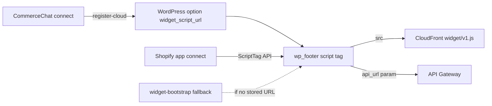

# Function Spec: Web Chat Widget

**Parent:** [00-MASTER-ARCHITECTURE.md](../00-MASTER-ARCHITECTURE.md)  
**Version:** 1.0

---

## 1. Purpose

Provide an embeddable JavaScript chat widget merchants add to their storefront, sharing the same AI orchestrator and tools as social channels.

### Implementation status (2026-06-16)

| Spec | Shipped | Notes |
|------|---------|-------|
| Embed script | `apps/widget/public/v1.js` | CDN: `https://dtm79sin0m5bg.cloudfront.net/widget/v1.js` |
| UI framework | Vanilla JS + shadow DOM on `<commercechat-root>` | Avoids Shopify Dawn `div:empty { display:none }` on empty hosts |
| Chat API | `POST /api/v1/widget/chat` (sync) + `/chat/stream` (SSE) | Typing events, token streaming |
| Auth | `X-API-Key: pk_live_...` or `cc_wp_...` | Same orchestrator as admin test chat |
| Config | `GET /api/v1/widget/config` | Greeting, colors, `suggestedQuestions`, `enabled` |
| API base URL | `data-api-url` or `?api_url=` on script src | Required when script is served from CDN (not API origin) |
| Bot formatting | `formatBotText()` | `**bold**`, lists, `\n` → `<br>` |
| Product UI | Carousel cards (up to 5) | Multi-image dots; `search_products` tool |
| Rate limits | Per-plan | `WIDGET_CHAT_RATE_LIMITS` / config limits in `billing/plans.ts` |
| CDN | CloudFront (`npm run deploy:widget`) | Dev: `https://dtm79sin0m5bg.cloudfront.net/widget/v1.js` |
| WordPress plugin | `commercechat-connector` | Toggle in WP admin; `register-cloud` stores `widgetScriptUrl` |
| Shopify app | ScriptTag via Admin API | Toggle in CommerceChat admin or Shopify app; URL includes `api_key`, `api_url`, `&v=4` |
| Demo | `http://localhost:3001/widget/demo.html?key=...` | Must use HTTP (CORS blocks `file://`) |

---

## 2. Embed method

Merchants add one script tag to their site:

```html
<script
  src="https://dtm79sin0m5bg.cloudfront.net/widget/v1.js"
  data-api-key="pk_live_abc123"
  data-api-url="https://YOUR-API.execute-api.us-east-1.amazonaws.com"
  async
></script>
```

**Shopify:** installed automatically via ScriptTag when the store is connected and widget is enabled (`write_script_tags` scope). URL shape:

```
{CDN}/widget/v1.js?api_key=pk_live_...&api_url={API}&v=4
```

**WordPress:** injected by `commercechat-connector` when **Show CommerceChat widget on storefront** is checked.

### Loader responsibilities (shipped — single bundle)

1. Read `data-api-key` or `?api_key=` from script URL
2. Resolve API base from `data-api-url` or `?api_url=` (falls back to script origin — wrong on CDN-only embeds)
3. Fetch `GET /api/v1/widget/config` (respects `enabled: false`)
4. Mount shadow DOM bubble on `<commercechat-root>` (theme-safe host element)

---

## 3. Widget architecture

```
loader.js (2KB)
  └── widget.bundle.js (React or Preact)
        ├── ChatBubble (minimized)
        ├── ChatWindow (expanded)
        ├── MessageList
        ├── InputBar
        ├── ProductCard (rich message type)
        └── SSE client
```

Hosted on **S3 + CloudFront** (`cdn.commercechat.com`).

---

## 4. Chat API

### Endpoint

```
POST /api/v1/chat
Authorization: Bearer <tenant-public-key>
Content-Type: application/json
Accept: text/event-stream
```

### Request

```json
{
  "sessionId": "sess_xyz",
  "message": "Do you have blue sneakers in size 9?",
  "metadata": {
    "pageUrl": "https://store.com/products",
    "userAgent": "..."
  }
}
```

### Response (SSE stream)

```
event: token
data: {"text": "Let me "}

event: token
data: {"text": "check our "}

event: product_card
data: {"sku": "SHOE-BLU-9", "name": "Blue Runner", "price": 89.99, "imageUrl": "..."}

event: done
data: {"messageId": "msg_123", "usage": {"tokens": 450}}
```

---

## 5. Session management

| Item | Spec |
|------|------|
| Session ID | Client-generated UUID in `localStorage` |
| Persistence | `localStorage['cc_session_<tenantKey>']` |
| Expiry | 24h inactivity → new session |
| Conversation link | `sessionId` maps to `conversationId` in DynamoDB |

Unlike social channels, web sessions are anonymous unless merchant passes `data-customer-id` (optional).

---

## 6. Differences from social orchestration

| Feature | Web | Social |
|---------|-----|--------|
| Streaming | SSE enabled | Disabled (full response) |
| Rich cards | Product cards, buttons | Plain text / channel templates |
| Markdown | Supported | Stripped |
| Latency target | < 4s p95 | < 8s p95 |
| Sync API | Direct Lambda invoke | SQS async |

**Shared:** Same orchestrator library, tools, RAG, LLM router.

---

## 7. Widget configuration (per tenant)

Fetched from `GET /api/v1/widget/config?key=pk_live_abc`:

```json
{
  "storeName": "Acme Shoes",
  "greeting": "Hi! How can I help you shop today?",
  "primaryColor": "#4F46E5",
  "position": "bottom-right",
  "avatarUrl": "https://cdn.../avatar.png",
  "suggestedQuestions": [
    "What are your best sellers?",
    "Shipping info",
    "Return policy"
  ],
  "enabled": true
}
```

---

## 8. Security

| Threat | Mitigation |
|--------|------------|
| API key abuse | Rate limit per key: 60 req/min; WAF |
| XSS from host page | Shadow DOM on `<commercechat-root>`; `pointer-events` on bubble/panel only |
| Theme CSS hiding host | Custom element host (not `div:empty`); inline `display:block!important` on host |
| CSRF | Public key auth only on chat endpoint; no cookies |
| Key extraction | Key is public-by-design; rate limits + domain allowlist (Pro) |

### Domain allowlist (Pro plan)

```json
{
  "allowedDomains": ["store.com", "www.store.com"]
}
```

Validate `Origin` header against allowlist.

---

## 9. UI specification

### Chat bubble

- 60×60px circle, bottom-right default
- Unread badge count
- Pulse animation on first visit (optional)

### Chat window

- 380×600px desktop; full-screen mobile
- Header: store name + close button
- Message area: scrollable, auto-scroll on new messages
- Input: text field + send button; Enter to send
- Suggested questions shown on empty state

### Product card component

```
┌─────────────────────────┐
│ [image]  Blue Runner     │
│          $89.99          │
│  [Add to Cart] [Details] │
└─────────────────────────┘
```

Button clicks send structured message to API:
```json
{ "action": "add_to_cart", "sku": "SHOE-BLU-9" }
```

---

## 10. CDN deployment



| Asset | Cache |
|-------|-------|
| `v1.js` | CloudFront default |
| Widget config API | Client-side fetch |
| WP bootstrap script URL | Transient 1h in WordPress |

Versioned URLs: `widget/v1.2.3/bundle.js` for cache busting.

---

## 11. Lambda functions

| Function | Trigger | Responsibility |
|----------|---------|----------------|
| `chat-api` | API Gateway POST | Sync orchestrator + SSE |
| `widget-config` | API Gateway GET | Return tenant widget config |

---

## 12. Analytics events (client)

| Event | Payload |
|-------|---------|
| `widget_opened` | tenantKey, sessionId |
| `message_sent` | sessionId, length |
| `product_card_clicked` | sku |
| `checkout_clicked` | cartId |

Sent to `POST /api/v1/analytics/events` (batched, fire-and-forget).

---

## 13. Testing checklist

- [x] Embed script loads on third-party HTML page (local demo)
- [x] Shadow DOM isolates styles from host
- [x] Shopify Dawn theme — bubble visible (`commercechat-root` host)
- [x] `api_url` param loads config from API when script is on CDN
- [x] Widget respects `enabled: false` from config API
- [ ] SSE streaming renders tokens incrementally
- [~] Product action chips render when API returns `suggestedActions`
- [ ] Rich product cards (image + add-to-cart) render in message list
- [x] Session persists on page reload (`localStorage`)
- [ ] Rate limit triggers gracefully
- [ ] Domain allowlist blocks unauthorized origins
- [ ] Mobile responsive full-screen mode
- [~] Same cart/tools behavior as admin test chat (tools work; WhatsApp path not live)
