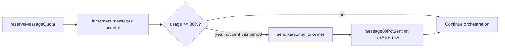

# Function Spec: Billing & Usage Metering

**Parent:** [00-MASTER-ARCHITECTURE.md](../00-MASTER-ARCHITECTURE.md)  
**Version:** 1.0

---

## 1. Purpose

Monetize the SaaS platform via subscription plans, meter message and resource usage per tenant, enforce quotas, and integrate with Stripe for payments.

---

## 2. Pricing plans (v1)

| Plan | Price/mo | Messages | Channels | Sources | Vectors | Team |
|------|----------|----------|----------|---------|---------|------|
| **Starter** | $49 | 2,000 | 1 + web | 3 | 10K | 1 |
| **Pro** | $149 | 10,000 | All + web | 10 | 50K | 5 |
| **Business** | $399 | 50,000 | All + web | Unlimited | 500K | 20 |

### Overage

| Resource | Overage price |
|----------|---------------|
| Messages | $0.02 per message over quota |
| Storage (vectors + raw) | $0.10 per GB over quota |
| LLM tokens (optional Phase 2) | Pass-through + 20% margin |

---

## 3. Stripe integration

### Products and prices

```
stripe products:
  - commercechat_starter  → price_starter_monthly ($49)
  - commercechat_pro      → price_pro_monthly ($149)
  - commercechat_business → price_business_monthly ($399)
```

### Flows

| Flow | Stripe feature |
|------|----------------|
| Signup + subscribe | Checkout Session |
| Upgrade/downgrade | Customer Portal or API |
| Trial (14 days) | Subscription with `trial_period_days: 14` |
| Overage billing | Metered usage records (Phase 2) or invoice line items |
| Failed payment | `invoice.payment_failed` webhook → suspend tenant |
| Cancellation | `customer.subscription.deleted` → cancel state |

---

## 4. Usage metering

### Counters (DynamoDB)

| PK | SK | Attributes |
|----|-----|------------|
| `TENANT#<id>` | `USAGE#2026-06` | messages, inputTokens, outputTokens, ingestJobs, storageMb |

### Increment points

| Event | Counter |
|-------|---------|
| Orchestrator completes outbound message | `messages += 1` |
| LLM call completes | `inputTokens += n`, `outputTokens += n` |
| Ingest job completes | `ingestJobs += 1`, `storageMb += delta` |

**Atomic increment:** DynamoDB `UpdateItem` with `ADD`.

### Quota check (before orchestration) — implemented

`reserveMessageQuota(tenantId)` atomically increments the monthly `messages` counter with a DynamoDB condition (`messages < maxMessages`) before the LLM runs. Returns `PLAN_LIMIT_EXCEEDED` (HTTP 429) when at cap.

`assertChannelEnabled(tenantId, channel)` blocks channels not in the tenant `LIMITS.enabledChannels` list.

**Soft limit (80%):** Shown in admin Usage/Billing UI (`messagesPct`). **Email warning shipped** — `maybeSendMessageQuotaWarning()` sends one SMTP/Resend email per billing period when usage crosses 80% (`message80PctSent` on `USAGE#{period}`).  
**Hard limit (100%):** Orchestrator rejects new AI turns; Meta channels receive a short auto-reply explaining the limit.  
**Suspended tenant:** `assertTenantOperational` blocks widget, Meta, and chat when status is `suspended` or trial expired.



**Code:** `packages/core/src/billing/quota-email.ts` · called from `packages/core/src/chat/usage.ts`.

### Billing lifecycle (implemented, no Stripe)

Daily EventBridge rule invokes `runBillingLifecycle()`:

- Expire trials past `trialEndsAt` → `suspended` + email
- End subscriptions with `cancelAtPeriodEnd` past period end → `cancelled` + email
- Manual HTTP: `POST /internal/cron/billing-lifecycle` with `x-cron-secret` (secret in Lambda env on AWS)

Cancel/reactivate APIs: `POST /api/v1/billing/cancel`, `POST /api/v1/billing/reactivate` (trial cannot cancel).

**Payment:** Stripe deferred. Checkout returns redirect URL stub for Sri Lankan / external gateway (`PAYMENT_GATEWAY_URL` template).

---

## 5. Webhook handler

### Lambda: `stripe-webhook`

| Event | Action |
|-------|--------|
| `checkout.session.completed` | Activate tenant, set plan |
| `customer.subscription.updated` | Update plan/limits |
| `customer.subscription.deleted` | Set status `cancelled` |
| `invoice.payment_failed` | Set status `suspended`; email merchant via Resend — [12-notifications-email-sms.md](12-notifications-email-sms.md) |
| `invoice.paid` | Set status `active` |

Verify `Stripe-Signature` header on every webhook.

---

## 6. Tenant billing state sync

```
Stripe subscription status → tenant.status + tenant.plan + LIMITS record
```

| Stripe status | Tenant status |
|---------------|---------------|
| `trialing` | trial |
| `active` | active |
| `past_due` | suspended |
| `canceled` | cancelled |
| `unpaid` | suspended |

---

## 7. APIs

| Method | Path | Auth | Description |
|--------|------|------|-------------|
| POST | `/api/v1/billing/checkout` | JWT | Create Stripe Checkout session |
| GET | `/api/v1/billing/portal` | JWT | Stripe Customer Portal URL |
| GET | `/api/v1/billing/usage` | JWT | Current period usage vs limits |
| GET | `/api/v1/billing/invoices` | JWT | Invoice history (from Stripe) |

---

## 8. Admin UI elements

| Component | Data source |
|-----------|-------------|
| Plan badge | tenant.plan |
| Usage progress bar | usage/limit |
| Upgrade CTA | Stripe Checkout |
| Manage billing button | Stripe Portal |
| Invoice list | Stripe API |

---

## 9. Cost tracking (internal)

Track platform COGS per tenant for margin analysis:

| Cost component | Source |
|----------------|--------|
| LLM tokens | Orchestrator logs |
| Embeddings | Ingest job stats |
| AWS compute | CloudWatch + cost allocation tags |
| Meta API | Free (no per-message Meta fee for Cloud API) |

Monthly internal report: `revenue - COGS per tenant`.

---

## 10. DynamoDB: LIMITS record

```json
{
  "maxMessages": 10000,
  "maxSources": 10,
  "maxVectors": 50000,
  "maxStorageMb": 500,
  "maxTeamMembers": 5,
  "enabledChannels": ["whatsapp", "messenger", "instagram", "web"],
  "features": {
    "conversationIngest": true,
    "analytics": true,
    "domainAllowlist": true
  }
}
```

Updated on plan change via Stripe webhook.

---

## 11. Testing checklist

- [ ] Checkout creates subscription and activates tenant
- [ ] Usage increments on each message
- [ ] Quota block at 100%
- [ ] Warning email at 80%
- [ ] Payment failure suspends tenant
- [ ] Upgrade changes limits immediately
- [ ] Stripe webhook signature validated
- [ ] Cancelled tenant retains read-only access 30 days
