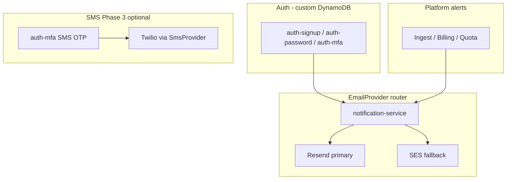

# Function Spec: Notifications (Email & SMS)

**Parent:** [00-MASTER-ARCHITECTURE.md](../00-MASTER-ARCHITECTURE.md)  
**Version:** 1.1  
**Status:** Adopted strategy (no Cognito — all auth email via Resend)

---

## 1. Purpose

Send transactional email and (optionally) SMS to **merchants** for auth, alerts, and billing — using a pluggable provider abstraction. Customer chat on WhatsApp/Messenger/Instagram is **not** handled here (Meta delivers those messages).

---

## 2. Adopted strategy

| Layer | Phase | Implementation |
|-------|-------|----------------|
| **Merchant auth email** | MVP+ | `auth-*` Lambdas → **Resend** via `EmailProvider` — see [13-custom-auth.md](13-custom-auth.md) |
| **Platform notifications** | MVP+ | Same `EmailProvider` → **Resend** (SendGrid adapter optional) |
| **MFA email OTP** | Phase 2 | `auth-mfa-verify` → Resend template `mfa-email-otp` |
| **SMS** | MVP | **Skipped** |
| **SMS MFA / alerts** | Phase 3 | `SmsProvider` → **Twilio** — see doc 13 |
| **Abstraction** | Day 1 | `EmailProvider` / `SmsProvider` interfaces (same pattern as LLM router) |

---

## 3. Architecture



---

## 4. Provider interfaces

### EmailProvider

```typescript
interface EmailProvider {
  readonly name: "resend" | "sendgrid" | "ses";

  send(params: EmailMessage): Promise<EmailResult>;
}

interface EmailMessage {
  to: string | string[];
  from: string;           // notifications@commercechat.com
  replyTo?: string;
  subject: string;
  html: string;
  text?: string;
  tags?: string[];        // e.g. ["ingest-failed", "tenant:ten_123"]
  idempotencyKey?: string;
}

interface EmailResult {
  messageId: string;
  provider: string;
}
```

### SmsProvider (Phase 2+, optional)

```typescript
interface SmsProvider {
  readonly name: "twilio" | "sns";

  send(params: SmsMessage): Promise<SmsResult>;
}

interface SmsMessage {
  to: string;             // E.164 format
  body: string;
  tags?: string[];
}
```

### Router configuration (SSM Parameter Store)

```yaml
# /commercechat/config/notifications
email:
  primary: resend
  fallback: ses
sms:
  enabled: false        # MVP
  primary: twilio       # Phase 2+ when enabled
```

### Secrets (Secrets Manager)

```
/commercechat/platform/email/resend     → { apiKey: "re_..." }
/commercechat/platform/email/sendgrid   → { apiKey: "SG...." }  # optional
/commercechat/platform/sms/twilio       → { accountSid, authToken }  # Phase 2+
```

---

## 5. Email types and senders

| Email type | Phase | Sender path | Template ID |
|------------|-------|-------------|-------------|
| Signup verification | MVP | auth-signup → Resend | `verify-email` |
| Password reset | MVP | auth-password → Resend | `password-reset` |
| Team invite | MVP | auth-invite → Resend | `team-invite` |
| Welcome / onboarding | MVP | notification-service → Resend | `welcome` |
| Ingest job failed | MVP | notification-service → Resend | `ingest-failed` |
| Meta token expired | MVP | notification-service → Resend | `meta-token-expired` |
| MFA email OTP | Phase 2 | auth-mfa → Resend | `mfa-email-otp` |
| Quota 80% warning | Phase 2 | notification-service → Resend | `quota-warning` |
| Quota 100% blocked | Phase 2 | notification-service → Resend | `quota-exceeded` |
| Payment failed | Phase 2 | notification-service → Resend | `payment-failed` |
| Invoice receipt | Phase 2 | Stripe (optional) or Resend | `invoice` |

---

## 6. MVP implementation

### 6.1 Auth + platform email (unified Resend)

Auth Lambdas ([13-custom-auth.md](13-custom-auth.md)) and platform alerts share the same `EmailProvider` router and Resend domain.

| Setting | Value |
|---------|-------|
| From address | `CommerceChat <notifications@commercechat.com>` |
| Domain | Verify `commercechat.com` in Resend (DKIM + SPF in Route 53) |
| SES | Optional fallback adapter only — not used for auth |
| MFA email | Phase 2 — template `mfa-email-otp` |

### 6.2 Notification module (Resend)

**Module structure:**

```
src/
  notifications/
    types.ts
    email-router.ts
    adapters/
      resend.ts
      sendgrid.ts
      ses.ts
    templates/
      verify-email.html
      password-reset.html
      team-invite.html
      mfa-email-otp.html
      welcome.html
      ingest-failed.html
      meta-token-expired.html
    notification-service.ts
```

**notification-service API (internal):**

```typescript
async function notify(tenantId: string, template: string, data: object): Promise<void> {
  const tenant = await getTenantProfile(tenantId);
  const provider = emailRouter.resolve();
  await provider.send({
    to: tenant.ownerEmail,
    from: "CommerceChat <notifications@commercechat.com>",
    subject: renderSubject(template, data),
    html: renderTemplate(template, data),
    tags: [template, `tenant:${tenantId}`],
    idempotencyKey: `${template}:${tenantId}:${data.eventId}`
  });
}
```

### 6.3 Resend adapter

| Item | Detail |
|------|--------|
| API | `POST https://api.resend.com/emails` |
| Auth | Bearer token from Secrets Manager |
| Domain | Verify `commercechat.com` in Resend dashboard |
| Rate limits | Resend plan limits; retry 429 with backoff |

### 6.4 SendGrid adapter (optional alternate)

Same interface; swap via SSM config `email.primary: sendgrid`. No code changes outside router.

---

## 7. Phase 2+: SMS (optional)

Enable only for **SMS MFA** (Phase 3) or merchant SMS alerts.

| Use case | Implementation |
|----------|----------------|
| SMS MFA OTP | `auth-mfa-verify` → `SmsProvider` → Twilio — [13-custom-auth.md](13-custom-auth.md) |
| Merchant alert SMS | `notification-service` → `SmsProvider` |

**Default:** Keep SMS disabled (`sms.enabled: false`).

---

## 8. Lambda functions

| Function | Phase | Trigger | Responsibility |
|----------|-------|---------|----------------|
| `notification-service` | MVP | Internal invoke | Route to EmailProvider, render templates |
| `notify-ingest-failed` | MVP | Step Functions catch | Call notification-service |
| `notify-meta-token-expired` | MVP | EventBridge | Call notification-service |
| `auth-signup` / `auth-password` | MVP | API Gateway | Auth emails via same EmailProvider |
| `auth-mfa-verify` | Phase 2 | API Gateway | Email OTP via Resend; SMS via Twilio (Phase 3) |

---

## 10. Error handling

| Error | Action |
|-------|--------|
| ESP 429 rate limit | Exponential backoff; retry 3× |
| ESP 5xx | Fallback to SES adapter |
| Invalid email address | Log; do not retry |
| MFA OTP send failure | Retry once; log challengeId only |
| All providers fail | SNS ops alert; persist to `TENANT#id / NOTIFICATION#failed` |

---

## 11. Observability

### Structured log fields

```json
{
  "service": "notification-service",
  "provider": "resend",
  "template": "ingest-failed",
  "tenantId": "ten_123",
  "messageId": "msg_abc",
  "latencyMs": 340
}
```

### Metrics

- `EmailsSent` by provider, template
- `EmailFailures` by provider
- `EmailFallbackToSes` count

---

## 12. Security

| Rule | Detail |
|------|--------|
| API keys | Secrets Manager only |
| Decrypted OTP | Never log; clear from memory after send |
| Unsubscribe | Platform emails include support link; auth emails exempt |
| Bounce handling | Configure Resend webhooks → disable bad addresses (Phase 2) |
| SPF/DKIM/DMARC | Required on `commercechat.com` before launch |

---

## 13. Cost estimate

| Item | MVP volume (~500 emails/mo) | Cost |
|------|----------------------------|------|
| Resend (auth + platform) | ~500 emails | Free tier or ~$0 |
| Twilio SMS | 0 (disabled) | $0 |
| **Total** | | **< $1/mo** |

---

## 14. Testing checklist

### MVP

- [ ] Signup verification email via Resend
- [ ] Password reset email via Resend
- [ ] Ingest failure triggers Resend notification
- [ ] Meta token expiry triggers Resend notification
- [ ] EmailProvider router reads SSM config
- [ ] Resend failure falls back to SES
- [ ] Idempotency key prevents duplicate sends
- [ ] No SMS sent anywhere in MVP

### Phase 2

- [ ] MFA email OTP via Resend
- [ ] Quota warning emails at 80% and 100%
- [ ] Stripe payment-failed email

### Phase 3

- [ ] (Optional) Twilio SMS MFA works

---

## 15. Dependencies

| Depends on | Provides to |
|------------|-------------|
| Secrets Manager, SSM | All functions sending mail |
| [13 Custom Auth](13-custom-auth.md) | Auth + MFA email triggers |
| Resend account + domain | All merchant email |
| SES verified domain | Optional EmailProvider fallback |
| [01 SaaS Tenant](01-saas-tenant-platform.md) | Merchant email addresses |
| [08 Admin Dashboard](08-admin-dashboard.md) | Notification preferences (Phase 2) |
| [09 Billing](09-billing-usage.md) | Payment/quota emails |
