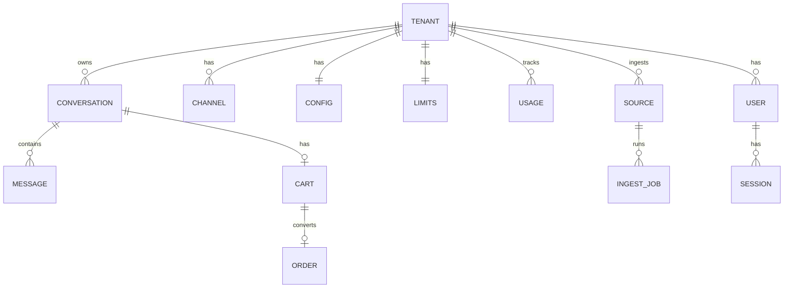

# Database Design — DynamoDB

**Parent:** [00-MASTER-ARCHITECTURE.md](../00-MASTER-ARCHITECTURE.md)  
**Version:** 1.0  
**Store:** Amazon DynamoDB (single-table design)

---

## 1. Overview


| Item               | Value                                                             |
| ------------------ | ----------------------------------------------------------------- |
| Table name         | `CommerceChat-Main`                                               |
| Billing mode       | On-demand (PAY_PER_REQUEST)                                       |
| Partition strategy | `TENANT#<tenantId>` for tenant data; global keys for auth lookups |
| PITR               | Enabled (prod)                                                    |
| TTL attribute      | `ttl` (epoch seconds) on ephemeral records                        |


### Design principles

1. **Single table** per environment — tenant isolation via `PK` prefix
2. **No cross-tenant queries** in application code (except email login GSI)
3. **Credential records stay tenant-scoped** — Meta tokens and commerce credentials use encrypted DynamoDB tenant records
4. **Vectors not in DynamoDB** — embeddings in S3 Vectors; only metadata here
5. **MFA-ready** user records from day one

---

## 2. Key structure

### Primary keys


| PK pattern              | SK pattern                        | Entity                     |
| ----------------------- | --------------------------------- | -------------------------- |
| `TENANT#<tenantId>`     | `PROFILE`                         | Tenant profile             |
| `TENANT#<tenantId>`     | `CONFIG`                          | Bot + LLM config           |
| `TENANT#<tenantId>`     | `LIMITS`                          | Plan limits                |
| `TENANT#<tenantId>`     | `USAGE#<YYYY-MM>`                 | Monthly usage              |
| `TENANT#<tenantId>`     | `USER#<userId>`                   | Merchant user              |
| `TENANT#<tenantId>`     | `SESSION#<sessionId>`             | Auth session               |
| `TENANT#<tenantId>`     | `CHANNEL#<channel>`               | Channel binding            |
| `TENANT#<tenantId>`     | `CONV#<channel>#<externalUserId>` | Conversation index         |
| `TENANT#<tenantId>`     | `MSG#<conversationId>#<ts>`       | Message                    |
| `TENANT#<tenantId>`     | `CART#<conversationId>`           | Cart                       |
| `TENANT#<tenantId>`     | `ORDER#<orderId>`                 | Order                      |
| `TENANT#<tenantId>`     | `SOURCE#<sourceId>`               | Knowledge source           |
| `TENANT#<tenantId>`     | `JOB#<jobId>`                     | Ingest job                 |
| `TENANT#<tenantId>`     | `PRODUCT#<sku>`                   | Product (optional cache)   |
| `TENANT#<tenantId>`     | `IDEMPOTENCY#<key>`               | Webhook dedup              |
| `EMAIL#<normalized>`    | `USER`                            | Global email lookup        |
| `PHONE#<phoneNumberId>` | `TENANT`                          | WhatsApp routing           |
| `PAGE#<pageId>`         | `TENANT`                          | Messenger routing          |
| `IG#<igUserId>`         | `TENANT`                          | Instagram routing          |
| `APIKEY#<hash>`         | `TENANT`                          | Widget key routing         |
| `TOKEN#<tokenHash>`     | `META`                            | Verify/reset/invite tokens |
| `MFA_CHALLENGE#<id>`    | `META`                            | MFA step-2 challenge       |
| `STRIPE#<customerId>`   | `TENANT`                          | Stripe customer mapping    |


---

## 3. Global Secondary Indexes

### GSI1 — `GSI1-PK` / `GSI1-SK` (tenant queries)


| GSI1-PK             | GSI1-SK                     | Use                        |
| ------------------- | --------------------------- | -------------------------- |
| `TENANT#<tenantId>` | `CONV#<updatedAt>`          | List conversations (admin) |
| `TENANT#<tenantId>` | `MSG#<conversationId>#<ts>` | Messages by conversation   |
| `TENANT#<tenantId>` | `JOB#<createdAt>`           | Ingest jobs list           |


*Note: Some access patterns use base table SK prefix queries on `TENANT#` PK instead.*

### GSI2 — `EntityType` / `SortKey` (admin lists — Phase 2)


| entityType     | sortKey                        | Use                        |
| -------------- | ------------------------------ | -------------------------- |
| `CONVERSATION` | `<updatedAt>#<conversationId>` | Cross-filter conversations |
| `INGEST_JOB`   | `<createdAt>#<jobId>`          | Job dashboard              |


---

## 4. Entity schemas

### 4.1 Tenant profile

```
PK: TENANT#ten_abc123
SK: PROFILE
```

```json
{
  "tenantId": "ten_abc123",
  "storeName": "Acme Shoes",
  "ownerEmail": "owner@store.com",
  "plan": "trial",
  "status": "trial",
  "timezone": "America/New_York",
  "stripeCustomerId": null,
  "widgetApiKeyHash": "sha256:...",
  "widgetApiKeyPrefix": "pk_live_abc",
  "onboardingStep": "channels",
  "createdAt": "2026-06-06T10:00:00Z",
  "updatedAt": "2026-06-06T10:00:00Z"
}
```


| Field            | Type | Notes                                                  |
| ---------------- | ---- | ------------------------------------------------------ |
| `plan`           | enum | `trial`, `starter`, `pro`, `business`, `enterprise`    |
| `status`         | enum | `trial`, `active`, `suspended`, `cancelled`, `deleted` |
| `onboardingStep` | enum | `profile`, `channels`, `knowledge`, `test`, `complete` |


---

### 4.2 Tenant config

```
PK: TENANT#ten_abc123
SK: CONFIG
```

```json
{
  "llmConfig": {
    "primaryProvider": "openai",
    "fallbackProvider": "bedrock",
    "models": {
      "faq": "gpt-4o-mini",
      "product": "gpt-4o-mini",
      "checkout": "gpt-4o-mini"
    },
    "embeddingModel": "text-embedding-3-small"
  },
  "prompts": {
    "systemPrompt": "You are {{storeName}}'s AI shopping assistant...",
    "greeting": "Hi! How can I help you shop today?",
    "handoffMessage": "Let me connect you with our team."
  },
  "enabledChannels": ["whatsapp", "web"],
  "commerceConnector": {
    "type": "manual",
    "status": "connected",
    "checkoutBaseUrl": "https://store.com"
  },
  "featureFlags": {
    "conversationIngest": false,
    "socialIngest": false,
    "humanHandoff": false,
    "mfaAvailable": false
  },
  "widgetConfig": {
    "primaryColor": "#4F46E5",
    "position": "bottom-right",
    "suggestedQuestions": ["Shipping info", "Best sellers"]
  }
}
```

---

### 4.3 Plan limits

```
PK: TENANT#ten_abc123
SK: LIMITS
```

```json
{
  "maxMessages": 2000,
  "maxSources": 3,
  "maxVectors": 10000,
  "maxStorageMb": 100,
  "maxTeamMembers": 1,
  "messageRetentionDays": 90,
  "enabledChannels": ["whatsapp", "web"]
}
```

---

### 4.4 Usage (monthly)

```
PK: TENANT#ten_abc123
SK: USAGE#2026-06
```

```json
{
  "period": "2026-06",
  "messages": 342,
  "inputTokens": 890000,
  "outputTokens": 120000,
  "ingestJobs": 4,
  "storageMb": 12,
  "estimatedLlmCostUsd": 4.52,
  "updatedAt": "2026-06-15T12:00:00Z"
}
```

---

### 4.5 User

```
PK: TENANT#ten_abc123
SK: USER#usr_def456
GSI: EMAIL#owner@store.com → tenantId + userId
```

```json
{
  "userId": "usr_def456",
  "tenantId": "ten_abc123",
  "email": "owner@store.com",
  "emailNormalized": "owner@store.com",
  "name": "Jane Owner",
  "passwordHash": "$argon2id$v=19$...",
  "role": "owner",
  "status": "active",
  "emailVerified": true,
  "mfa": {
    "enabled": false,
    "method": "none",
    "totpSecretEncrypted": null,
    "enrolledAt": null,
    "backupCodesHash": []
  },
  "failedLoginAttempts": 0,
  "lockedUntil": null,
  "createdAt": "2026-06-06T10:00:00Z",
  "lastLoginAt": "2026-06-10T08:30:00Z"
}
```


| `role`   | Permissions                           |
| -------- | ------------------------------------- |
| `owner`  | All + billing + delete tenant         |
| `admin`  | Config, channels, ingest, team invite |
| `viewer` | Read conversations + analytics        |


---

### 4.6 Session

```
PK: TENANT#ten_abc123
SK: SESSION#sess_ghi789
TTL: expiresAt
```

```json
{
  "sessionId": "sess_ghi789",
  "userId": "usr_def456",
  "refreshTokenHash": "$argon2id$...",
  "mfaVerified": true,
  "userAgent": "Mozilla/5.0...",
  "ipHash": "sha256:...",
  "createdAt": "2026-06-10T08:30:00Z",
  "expiresAt": 1719580800,
  "ttl": 1719580800,
  "revoked": false
}
```

---

### 4.7 Channel binding

```
PK: TENANT#ten_abc123
SK: CHANNEL#whatsapp
```

```json
{
  "channel": "whatsapp",
  "status": "connected",
  "phoneNumberId": "444555666",
  "wabaId": "111222333",
  "displayPhone": "+15551234567",
  "credentialsKey": "TENANT#ten_abc123 / SECRET#meta/whatsapp",
  "tokenExpiresAt": "2026-12-01T00:00:00Z",
  "lastHealthCheck": "2026-06-10T08:00:00Z",
  "connectedAt": "2026-06-07T14:00:00Z"
}
```

**Routing records (separate items):**

```
PK: PHONE#444555666  SK: TENANT  → { tenantId: "ten_abc123" }
PK: PAGE#123456789    SK: TENANT  → { tenantId: "ten_abc123" }
PK: IG#987654321      SK: TENANT  → { tenantId: "ten_abc123" }
```

---

### 4.8 Conversation

```
PK: TENANT#ten_abc123
SK: CONV#whatsapp#919876543210
```

```json
{
  "conversationId": "conv_jkl012",
  "tenantId": "ten_abc123",
  "channel": "whatsapp",
  "externalUserId": "919876543210",
  "cartId": "cart_mno345",
  "status": "active",
  "handoffStatus": "bot",
  "customerName": "Priya",
  "messageCount": 8,
  "lastInboundAt": "2026-06-10T09:15:00Z",
  "lastOutboundAt": "2026-06-10T09:15:08Z",
  "sessionExpiresAt": "2026-06-11T09:15:00Z",
  "createdAt": "2026-06-09T11:00:00Z",
  "updatedAt": "2026-06-10T09:15:08Z"
}
```


| `handoffStatus` | Phase | Values                                     |
| --------------- | ----- | ------------------------------------------ |
| MVP             | —     | `bot` only                                 |
| Phase 3         |       | `bot`, `handoff_requested`, `human_active` |


---

### 4.9 Message

```
PK: TENANT#ten_abc123
SK: MSG#conv_jkl012#2026-06-10T09:15:00.123Z
TTL: ttl (based on plan retention)
```

```json
{
  "messageId": "msg_pqr678",
  "conversationId": "conv_jkl012",
  "tenantId": "ten_abc123",
  "channel": "whatsapp",
  "direction": "inbound",
  "role": "user",
  "type": "text",
  "content": "Do you have blue sneakers size 9?",
  "externalMessageId": "wamid.xxx",
  "tokenCount": null,
  "metadata": {
    "intent": "product",
    "llmModel": null
  },
  "createdAt": "2026-06-10T09:15:00.123Z",
  "ttl": 1725945600
}
```

**Outbound assistant message:**

```json
{
  "direction": "outbound",
  "role": "assistant",
  "type": "text",
  "content": "Yes! I found 3 blue sneakers in size 9...",
  "metadata": {
    "intent": "product",
    "llmModel": "gpt-4o-mini",
    "llmProvider": "openai",
    "inputTokens": 2100,
    "outputTokens": 280,
    "toolCalls": ["search_products"]
  }
}
```

---

### 4.10 Cart

```
PK: TENANT#ten_abc123
SK: CART#conv_jkl012
TTL: ttl (7 days after updatedAt)
```

```json
{
  "cartId": "cart_mno345",
  "conversationId": "conv_jkl012",
  "tenantId": "ten_abc123",
  "items": [
    {
      "sku": "SHOE-BLU-9",
      "name": "Blue Runner Sneaker",
      "quantity": 1,
      "unitPrice": 89.99,
      "variant": "Size 9",
      "imageUrl": "https://..."
    }
  ],
  "subtotal": 89.99,
  "currency": "USD",
  "checkoutUrl": null,
  "checkoutToken": null,
  "createdAt": "2026-06-10T09:16:00Z",
  "updatedAt": "2026-06-10T09:16:00Z",
  "ttl": 1719763200
}
```

---

### 4.11 Order

```
PK: TENANT#ten_abc123
SK: ORDER#ord_stu901
```

```json
{
  "orderId": "ord_stu901",
  "conversationId": "conv_jkl012",
  "tenantId": "ten_abc123",
  "status": "pending",
  "items": [{ "sku": "SHOE-BLU-9", "quantity": 1, "unitPrice": 89.99 }],
  "total": 89.99,
  "currency": "USD",
  "checkoutUrl": "https://checkout.commercechat.com/...",
  "externalOrderId": null,
  "customerRef": "919876543210",
  "createdAt": "2026-06-10T09:20:00Z",
  "updatedAt": "2026-06-10T09:20:00Z"
}
```

---

### 4.12 Knowledge source

```
PK: TENANT#ten_abc123
SK: SOURCE#src_vwx234
```

```json
{
  "sourceId": "src_vwx234",
  "tenantId": "ten_abc123",
  "type": "website",
  "name": "Main website",
  "config": {
    "url": "https://acme-shoes.com",
    "maxDepth": 3,
    "maxPages": 500
  },
  "status": "active",
  "lastSyncAt": "2026-06-08T02:00:00Z",
  "lastJobId": "job_yza567",
  "chunkCount": 142,
  "vectorCount": 387,
  "createdAt": "2026-06-07T15:00:00Z"
}
```


| `type`         | `config` fields               |
| -------------- | ----------------------------- |
| `website`      | `url`, `maxDepth`, `maxPages` |
| `catalog`      | `s3Key`, `originalFilename`   |
| `faq`          | inline items count            |
| `conversation` | `s3Key`, `format`             |
| `social`       | `s3Key` or `platform`         |


---

### 4.13 Ingest job

```
PK: TENANT#ten_abc123
SK: JOB#job_yza567
```

```json
{
  "jobId": "job_yza567",
  "sourceId": "src_vwx234",
  "tenantId": "ten_abc123",
  "type": "website_sync",
  "status": "completed",
  "stats": {
    "pagesProcessed": 142,
    "chunksCreated": 387,
    "tokensEmbedded": 245000,
    "durationSec": 89,
    "errors": []
  },
  "error": null,
  "startedAt": "2026-06-08T02:00:01Z",
  "completedAt": "2026-06-08T02:01:30Z",
  "createdAt": "2026-06-08T02:00:00Z"
}
```


| `status`    | Description            |
| ----------- | ---------------------- |
| `queued`    | Waiting                |
| `running`   | In progress            |
| `completed` | Success                |
| `failed`    | Error in `error` field |
| `cancelled` | User cancelled         |


---

### 4.14 Product cache (optional)

```
PK: TENANT#ten_abc123
SK: PRODUCT#SHOE-BLU-9
```

```json
{
  "sku": "SHOE-BLU-9",
  "name": "Blue Runner Sneaker",
  "description": "Lightweight running shoe...",
  "price": 89.99,
  "currency": "USD",
  "category": "Sneakers",
  "inStock": true,
  "imageUrl": "https://...",
  "productUrl": "https://acme-shoes.com/products/blue-runner",
  "variants": ["Size 8", "Size 9", "Size 10"],
  "updatedAt": "2026-06-07T16:00:00Z"
}
```

Primary search still uses S3 Vectors; this table supports fast SKU lookup for tools.

---

### 4.15 Idempotency (webhooks)

```
PK: TENANT#ten_abc123
SK: IDEMPOTENCY#wa_wamid.xxx
TTL: 24h
```

```json
{
  "idempotencyKey": "wa_wamid.xxx",
  "processedAt": "2026-06-10T09:15:00Z",
  "ttl": 1719677700
}
```

---

### 4.16 Auth tokens (global)

```
PK: TOKEN#<sha256(token)>
SK: META
TTL: expiresAt
```

```json
{
  "purpose": "email_verify",
  "tenantId": "ten_abc123",
  "userId": "usr_def456",
  "email": "owner@store.com",
  "createdAt": "2026-06-06T10:00:00Z",
  "expiresAt": 1717766400,
  "ttl": 1717766400,
  "used": false
}
```


| `purpose`        | TTL       |
| ---------------- | --------- |
| `email_verify`   | 24 hours  |
| `password_reset` | 1 hour    |
| `team_invite`    | 7 days    |
| `email_otp`      | 5 minutes |


---

### 4.17 MFA challenge (global)

```
PK: MFA_CHALLENGE#mfa_ch_abc
SK: META
TTL: 5 min
```

```json
{
  "challengeId": "mfa_ch_abc",
  "tenantId": "ten_abc123",
  "userId": "usr_def456",
  "method": "totp",
  "otpHash": null,
  "attempts": 0,
  "maxAttempts": 5,
  "expiresAt": 1717670700,
  "ttl": 1717670700
}
```

---

## 5. S3 layout (companion storage)

```
s3://commercechat-data/
  <tenantId>/
    raw/website/<jobId>/*.html
    raw/catalog/<jobId>/products.csv
    raw/conversations/<jobId>/*
    parsed/<jobId>/chunks.jsonl
    media/<mediaId>.*
```

### S3 Vectors

```
Index namespace: tenant-<tenantId>
Metadata per vector: sourceId, source_type, sku, url, title, date
```

---

## 6. DynamoDB Tenant Credential Records


| Key pattern | Contents |
| ----------- | -------- |
| `TENANT#<tenantId> / SECRET#meta/whatsapp` | WhatsApp access token, WABA IDs |
| `TENANT#<tenantId> / SECRET#meta/messenger` | Messenger page token and Page ID |
| `TENANT#<tenantId> / SECRET#meta/instagram` | Instagram channel token and IDs |
| `TENANT#<tenantId> / SECRET#commerce/wordpress` | WooCommerce credentials |
| `TENANT#<tenantId> / SECRET#commerce/shopify` | Shopify credentials |


---

## 7. Access patterns


| Access pattern            | Operation                                              |
| ------------------------- | ------------------------------------------------------ |
| Login by email            | `GSI EMAIL#<email>` → get tenantId + userId → get USER |
| Webhook route WhatsApp    | `GET PHONE#<id> SK=TENANT`                             |
| Load tenant config        | `GET TENANT#<id> SK=CONFIG`                            |
| List conversations        | `QUERY TENANT#<id> SK begins_with CONV#`               |
| Get conversation messages | `QUERY TENANT#<id> SK begins_with MSG#<convId>#`       |
| Get/create cart           | `GET/PUT TENANT#<id> SK=CART#<convId>`                 |
| Increment usage           | `UPDATE TENANT#<id> SK=USAGE#<period>` ADD             |
| Check idempotency         | `CONDITIONAL PUT IDEMPOTENCY#`                         |


---

## 8. TTL summary


| Entity        | TTL                      |
| ------------- | ------------------------ |
| Session       | `expiresAt` (30 days)    |
| Cart          | 7 days after `updatedAt` |
| Message       | Plan retention (90d–2yr) |
| Idempotency   | 24 hours                 |
| Auth tokens   | Per purpose              |
| MFA challenge | 5 minutes                |


---

## 9. Migrations

DynamoDB is schemaless. Version config documents:

```
PK: TENANT#<id>  SK: CONFIG  →  configVersion: 1
```

Platform-wide schema version in SSM: `/commercechat/config/schemaVersion`.

---

## 10. Entity relationship diagram




