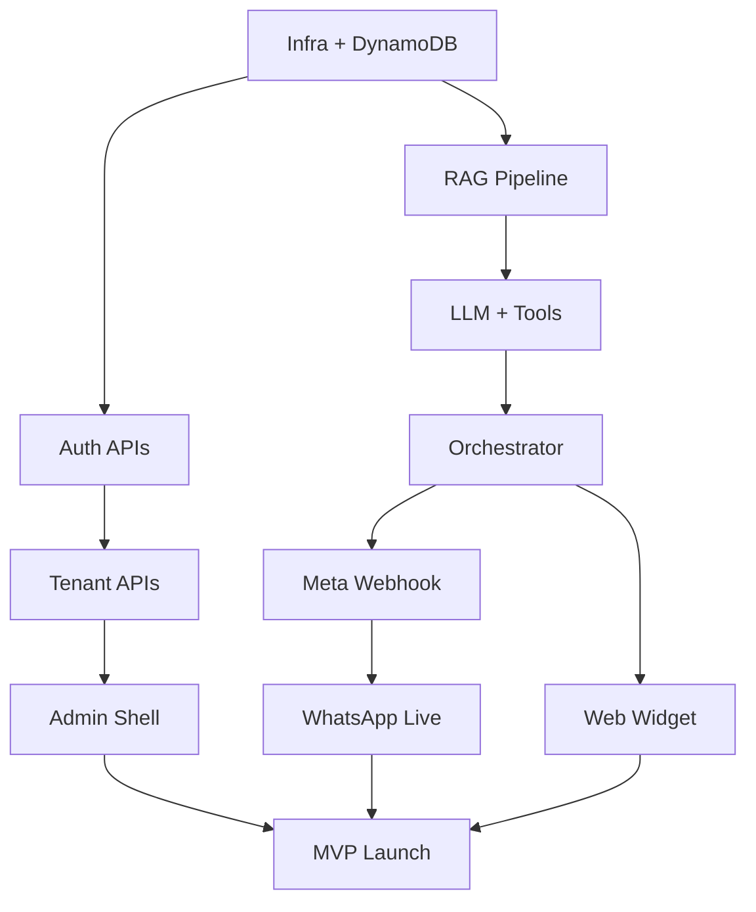

# Implementation Task Plan

**Parent:** [00-MASTER-ARCHITECTURE.md](../00-MASTER-ARCHITECTURE.md)  
**Version:** 1.0  
**Timeline:** MVP ~10 weeks (2.5 FTE)  
**Related:** [phases/01-phase-mvp.md](../phases/01-phase-mvp.md) · [06-api-implementation-status.md](06-api-implementation-status.md)  
**Last progress update:** 2026-06-07

---

## 0. Progress snapshot (local dev)

| Sprint | Status | Done locally |
|--------|--------|--------------|
| **Sprint 1 — Foundation** | ~95% | Auth, tenant profile/config/limits/usage, JWT, onboarding APIs, session auto-refresh; **not done:** CDK deploy, logo upload |
| **Sprint 2 — Knowledge** | ~85% | Website crawl, catalog CSV, embeddings, `FileVectorStore`, job polling, RAG retriever; **not done:** S3 Vectors prod, FAQ ingest, Step Functions |
| **Sprint 3 — Chat** | ~90% | Orchestrator, LLM, tools, cart persistence, usage metering, `POST /chat`, test simulator |
| **Sprint 4 — Meta** | 0% | Channels UI uses mock; conversations API live |
| **Sprint 5 — Widget** | ~70% | API key auth, widget config/chat, `v1.js` embed bundle, dashboard stats; **not done:** SSE stream, rate limits, CDN deploy |
| **Infra (Week 0)** | ~30% | LocalStack DynamoDB, local Lambda server; **not done:** CDK, CI, Resend email |

**35 real API routes** · **6 mock routes** remaining for MVP UI · See [06-api-implementation-status.md](06-api-implementation-status.md).

---

## 1. How to use this plan

- Tasks are ordered by **dependency** within each phase
- **Owner** roles: `BE` (backend), `FE` (frontend), `INF` (infra), `ALL`
- **Size:** S (< 1 day), M (1–3 days), L (3–5 days), XL (1+ week)
- Check `[ ]` boxes as completed during implementation
- Spike tasks marked with ⚡ should run early to de-risk

---

## 2. Pre-sprint setup (Week 0)

| # | Task | Owner | Size | Deps |
|---|------|-------|------|------|
| 0.1 | Create monorepo structure (`apps/admin`, `apps/api`, `packages/shared`) | INF | M | — |
| 0.2 | LocalStack `docker-compose` + env template | INF | M | 0.1 |
| 0.3 | AWS CDK / SST bootstrap (dev + staging) | INF | L | 0.1 |
| 0.4 | CI pipeline (lint, test, deploy dev) | INF | M | 0.3 |
| 0.5 | Clone Jetwing reference → scaffold Next.js admin shell | FE | M | 0.1 |
| 0.6 | Shared TypeScript types from [01-database-design.md](01-database-design.md) | BE | M | 0.1 |

---

## 3. Phase 1 — MVP (Weeks 1–10)

### Sprint 1: Foundation (Weeks 1–2)

**Goal:** Auth, tenant CRUD, DynamoDB, deployable API skeleton.

| # | Task | Owner | Size | Deps |
|---|------|-------|------|------|
| 1.1 | DynamoDB table + GSIs + TTL (CDK) | INF | M | 0.3 |
| 1.2 | S3 buckets (data, assets) | INF | S | 0.3 |
| 1.3 | Secrets Manager paths + SSM params | INF | S | 0.3 |
| 1.4 | API Gateway + Lambda authorizer (JWT) | BE | M | 1.1 |
| 1.5 | `POST /auth/signup` — transact write tenant + user + email lookup | BE | L | 1.1, 1.4 |
| 1.6 | `POST /auth/login` — argon2 verify + JWT + session | BE | M | 1.5 |
| 1.7 | `POST /auth/refresh`, `/logout` | BE | M | 1.6 |
| 1.8 | `POST /auth/forgot-password`, `/reset-password`, `/verify-email` | BE | M | 1.5 |
| 1.9 | Resend `EmailProvider` + verification/reset templates | BE | M | 1.8 |
| 1.10 | `GET/PATCH /api/v1/tenants/me` + config + limits | BE | M | 1.6 |
| 1.11 | Admin: login page + auth context (Jetwing pattern) | FE | M | 1.6 |
| 1.12 | Admin: onboarding step 1 (store profile) | FE | M | 1.10, 1.11 | **Done** |
| 1.13 | `GET /health` + structured logging (JSON) | BE | S | 1.4 | **Done** (local) |
| 1.14 | Onboarding APIs (`GET/PATCH /onboarding`, test-chat) | BE | M | 1.10 | **Done** (local) |
| 1.15 | Session auto-refresh + expired-session dialog | FE | M | 1.7 | **Done** |

**Sprint 1 exit criteria:**
- [x] Merchant can sign up, verify email, log in *(local; verify link in API console)*
- [x] JWT protects tenant APIs
- [x] Admin shows onboarding profile step
- [x] Onboarding wizard APIs (`GET/PATCH /onboarding`, test-chat)
- [ ] CDK-deployed API Gateway + DynamoDB (prod/staging)

---

### Sprint 2: Knowledge & RAG (Weeks 3–4)

**Goal:** Ingest website + catalog; vector search works.

| # | Task | Owner | Size | Deps |
|---|------|-------|------|------|
| 2.1 | ⚡ Spike: S3 Vectors create index + query (LocalStack mock) | BE | M | 0.2 |
| 2.2 | `EmbeddingProvider` — OpenAI text-embedding-3-small | BE | M | 2.1 |
| 2.3 | Website crawler Lambda (depth limit, robots.txt) | BE | L | 2.2 |
| 2.4 | Chunker + metadata tagger (`website`, `catalog`, `faq`) | BE | M | 2.3 |
| 2.5 | Ingest pipeline: SQS → Step Functions → embed → S3 Vectors | BE | L | 2.4 |
| 2.6 | Knowledge source CRUD APIs | BE | M | 1.10 | **Done** (local Lambda) |
| 2.7 | `POST /knowledge/sources/{id}/sync` + job status APIs | BE | M | 2.5, 2.6 | **Partial** (stub sync; pipeline pending) |
| 2.8 | Catalog CSV/JSON parser + product cache in DynamoDB | BE | M | 2.5 |
| 2.9 | Inline FAQ ingest API | BE | S | 2.4 |
| 2.10 | RAG retriever (hybrid: vector + source filter) | BE | M | 2.2 |
| 2.11 | Admin: knowledge sources page (add website, upload catalog) | FE | L | 2.6 |
| 2.12 | Admin: ingest job progress UI | FE | M | 2.7 |

**Sprint 2 exit criteria:**
- [x] Website crawl → chunks → vectors searchable *(local FileVectorStore)*
- [x] Catalog upload → product search via RAG
- [x] Admin can trigger sync and see job status

---

### Sprint 3: LLM & Chat Orchestration (Weeks 5–6)

**Goal:** End-to-end bot reply with tools on test channel.

| # | Task | Owner | Size | Deps |
|---|------|-------|------|------|
| 3.1 | `LLMProvider` router — OpenAI GPT-4o mini | BE | M | — |
| 3.2 | Intent classifier (lightweight; FAQ vs product vs checkout) | BE | M | 3.1 |
| 3.3 | System prompt builder (tenant config + RAG context) | BE | M | 2.10 |
| 3.4 | Commerce tools: `search_products`, `get_product_details` | BE | M | 2.8 |
| 3.5 | Commerce tools: `add_to_cart`, `get_cart`, `create_checkout_link` | BE | L | 3.4 |
| 3.6 | Commerce tools: `get_order_status` (stub) | BE | S | 3.5 |
| 3.7 | Tool executor + conversation/cart persistence | BE | L | 3.5, 1.1 |
| 3.8 | Chat orchestrator Lambda (unified message in → reply out) | BE | L | 3.2, 3.7 |
| 3.9 | Usage metering (tokens + messages per month) | BE | M | 3.8 |
| 3.10 | `POST /api/v1/chat` (internal test endpoint) | BE | M | 3.8 |
| 3.11 | Admin: bot config page (prompts, greeting) | FE | M | 1.10 |
| 3.12 | Admin: test chat console | FE | M | 3.10 |

**Sprint 3 exit criteria:**
- [x] Test console returns grounded answers with product search
- [~] Cart + checkout link flow works in test channel *(cart in DynamoDB; hosted checkout pending)*
- [x] Usage counters increment

---

### Sprint 4: WhatsApp + Meta (Weeks 7–8)

**Goal:** Live WhatsApp conversations.

| # | Task | Owner | Size | Deps |
|---|------|-------|------|------|
| 4.1 | Meta app setup + webhook URL (dev tunnel / staging) | ALL | M | — |
| 4.2 | `GET/POST /webhooks/meta` — verify + signature + enqueue | BE | M | 1.4 |
| 4.3 | Webhook router GSI (`PHONE#` → tenant) | BE | S | 1.1, 4.2 |
| 4.4 | WhatsApp inbound parser → `UnifiedMessage` | BE | M | 4.2 |
| 4.5 | WhatsApp outbound sender (Graph API) | BE | M | 4.4 |
| 4.6 | Idempotency + 24h session window handling | BE | M | 4.4 |
| 4.7 | `POST /channels/meta/connect` OAuth exchange | BE | L | 4.5 |
| 4.8 | Token refresh job (EventBridge cron) | BE | M | 4.7 |
| 4.9 | Channel health check API | BE | S | 4.7 |
| 4.10 | Admin: connect WhatsApp (Meta embedded signup) | FE | L | 4.7 |
| 4.11 | Admin: conversations list + message thread | FE | L | 7.1 APIs |
| 4.12 | Submit Meta App Review (WhatsApp messaging) | ALL | M | 4.10 |

**Sprint 4 exit criteria:**
- [ ] Inbound WhatsApp message → AI reply → outbound delivery
- [ ] Merchant connects WABA from admin
- [ ] Conversations visible in admin

---

### Sprint 5: Web Widget + Polish (Weeks 9–10)

**Goal:** Embeddable widget; MVP launch-ready.

| # | Task | Owner | Size | Deps |
|---|------|-------|------|------|
| 5.1 | Widget API key generation + `APIKEY#` routing | BE | M | 1.10 |
| 5.2 | `GET /api/v1/widget/config` | BE | S | 5.1 |
| 5.3 | `POST /api/v1/widget/chat` (sync) | BE | M | 3.8, 5.1 |
| 5.4 | Web widget JS bundle (embed snippet) | FE | L | 5.2, 5.3 |
| 5.5 | Widget: suggested questions + product cards | FE | M | 5.4 |
| 5.6 | Admin: widget settings + embed code copy | FE | M | 5.1 |
| 5.7 | Admin: usage dashboard (messages, tokens, limits) | FE | M | 3.9 |
| 5.8 | Rate limiting (API Gateway + Redis optional) | BE | M | 5.3 |
| 5.9 | Error handling + user-friendly fallbacks | BE | M | 3.8 |
| 5.10 | E2E tests: signup → ingest → WhatsApp reply | ALL | L | 4.*, 5.* |
| 5.11 | Staging soak test (100 concurrent chats) | ALL | M | 5.10 |
| 5.12 | Runbook + on-call alerts (CloudWatch) | INF | M | 5.11 |

**MVP exit criteria:**
- [ ] 3 pilot merchants onboarded
- [ ] WhatsApp + web widget both functional
- [ ] Knowledge ingest + product checkout link working
- [ ] Usage limits enforced
- [ ] Meta App Review submitted / approved

---

## 4. Phase 2 — Growth (Weeks 11–18)

### Sprint 6: Multi-channel (Weeks 11–12)

| # | Task | Owner | Size |
|---|------|-------|------|
| 6.1 | Messenger inbound/outbound adapters | BE | L |
| 6.2 | Instagram DM inbound/outbound adapters | BE | L |
| 6.3 | `PAGE#` / `IG#` routing records | BE | S |
| 6.4 | Admin: connect Messenger + Instagram | FE | M |
| 6.5 | Meta App Review (pages_messaging, instagram_manage_messages) | ALL | M |

---

### Sprint 7: Billing (Weeks 13–14)

| # | Task | Owner | Size |
|---|------|-------|------|
| 7.1 | Stripe products + prices setup | BE | M |
| 7.2 | `POST /billing/checkout` + Customer Portal | BE | M |
| 7.3 | `POST /webhooks/stripe` — subscription lifecycle | BE | L |
| 7.4 | Plan limits enforcement (hard cap messages) | BE | M |
| 7.5 | Admin: billing page + plan upgrade | FE | L |

---

### Sprint 8: MFA + Team (Weeks 15–16)

| # | Task | Owner | Size |
|---|------|-------|------|
| 8.1 | TOTP enrollment + `POST /auth/mfa/verify` | BE | L |
| 8.2 | Email OTP MFA via Resend | BE | M |
| 8.3 | Team invite flow + `POST /auth/invite` | BE | M |
| 8.4 | Role-based API guards (`owner`/`admin`/`viewer`) | BE | M |
| 8.5 | Admin: MFA settings + team management | FE | L |

---

### Sprint 9: Analytics + Streaming (Weeks 17–18)

| # | Task | Owner | Size |
|---|------|-------|------|
| 9.1 | Conversation analytics aggregates | BE | L |
| 9.2 | Admin: analytics dashboard (charts) | FE | L |
| 9.3 | Widget SSE streaming (`/widget/chat/stream`) | BE | M |
| 9.4 | Conversation ingest (export → RAG) | BE | L |
| 9.5 | Social post ingest (Phase 2b) | BE | L |

---

## 5. Phase 3 — Scale (Weeks 19+)

| # | Task | Owner | Size |
|---|------|-------|------|
| 10.1 | Shopify connector (OAuth + product sync) | BE | XL |
| 10.2 | Human handoff queue + agent inbox | BE | XL |
| 10.3 | SMS MFA via Twilio `SmsProvider` | BE | M |
| 10.4 | Bedrock fallback in LLM router | BE | M |
| 10.5 | Multi-region / DR | INF | L |
| 10.6 | Enterprise SSO (SAML) | BE | XL |

---

## 6. Dependency graph (MVP)

---

## 7. Risk register

| Risk | Mitigation | Owner |
|------|------------|-------|
| Meta App Review delay | Submit week 7; use test WABA in parallel | ALL |
| S3 Vectors immaturity | Week 1 spike; OpenSearch fallback design | BE |
| LLM cost overrun | Usage caps + gpt-4o-mini default + caching | BE |
| RAG quality poor | Source tags + eval set (20 test questions) | BE |
| MVP scope creep | Freeze P2 features; 4 admin pages only | PM |

---

## 8. Definition of done (per task)

- [ ] Unit tests for business logic
- [ ] API matches [02-api-specification.md](02-api-specification.md)
- [ ] DynamoDB access matches [01-database-design.md](01-database-design.md)
- [ ] Structured logs with `tenantId`, `requestId`
- [ ] No secrets in code or DynamoDB
- [ ] PR reviewed + deployed to dev

---

## 9. Team allocation (MVP)

| Role | Focus weeks 1–4 | Focus weeks 5–8 | Focus weeks 9–10 |
|------|-----------------|-----------------|------------------|
| Backend ×1.5 | Auth, DB, RAG | LLM, orchestrator, Meta | Widget API, polish |
| Frontend ×1 | Admin shell, onboarding | Channels UI, conversations | Widget bundle, usage |
| Infra ×0.5 | CDK, LocalStack, CI | Webhooks, monitoring | Staging, load test |

---

## 10. Milestone calendar

| Week | Milestone |
|------|-----------|
| 2 | Auth + tenant APIs live |
| 4 | RAG ingest working |
| 6 | Test chat with commerce tools |
| 8 | WhatsApp E2E |
| 10 | **MVP launch** (3 pilots) |
| 14 | Stripe billing live |
| 18 | Messenger + IG + MFA |
