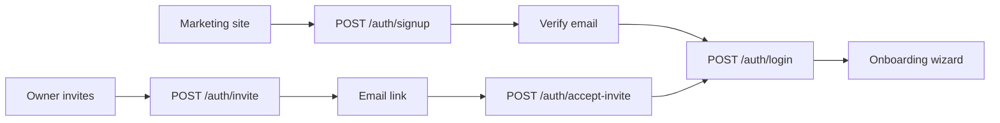
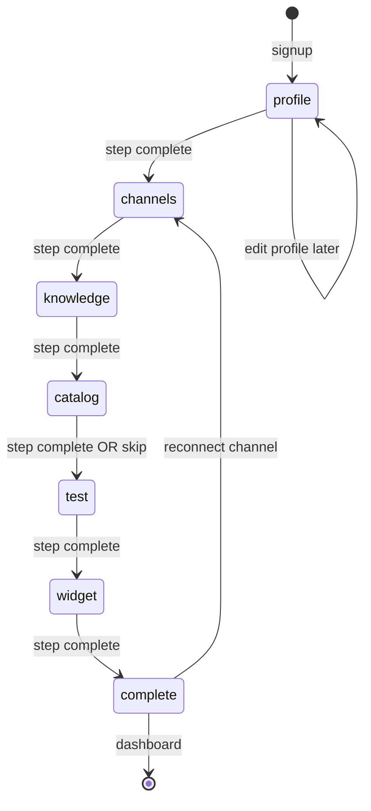
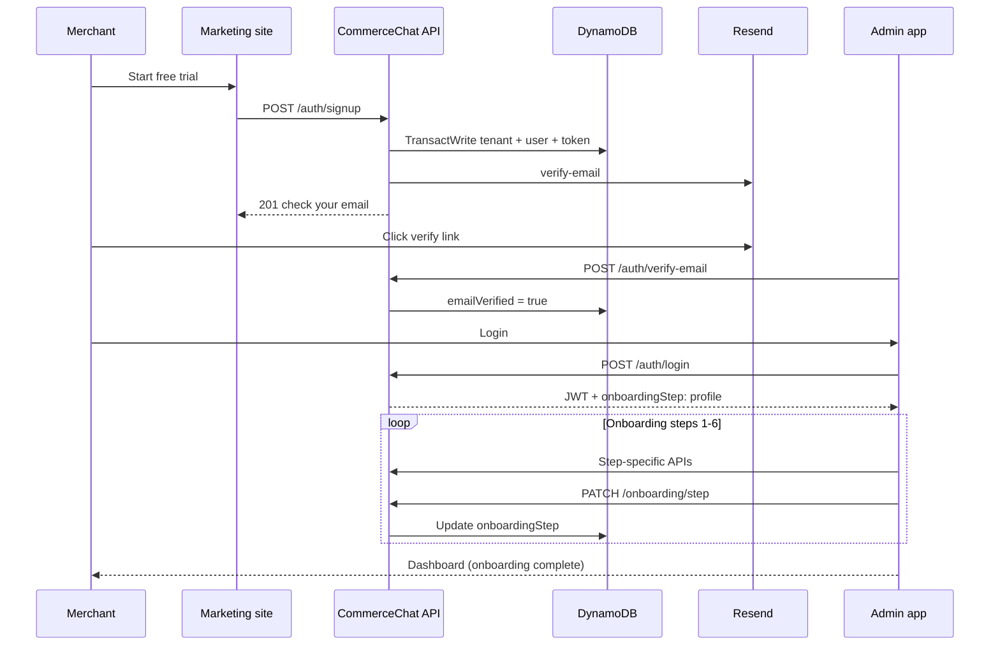

# Shop Onboarding & User Registration

**Parent:** [00-MASTER-ARCHITECTURE.md](../00-MASTER-ARCHITECTURE.md)  
**Related:** [02-api-specification.md](02-api-specification.md) · [01-database-design.md](01-database-design.md) · [13-custom-auth.md](../functions/13-custom-auth.md) · [08-admin-dashboard.md](../functions/08-admin-dashboard.md) · [06-api-implementation-status.md](06-api-implementation-status.md)  
**Implementation status (2026-06-07):** Onboarding APIs are **live** (`GET /onboarding`, `PATCH /onboarding/step`, `POST /onboarding/test-chat`). Wizard state persisted in DynamoDB (`PROFILE.onboardingStep` + `ONBOARDING#STATE`). **Channels step** still uses mock Meta connect.

---

## 1. Overview

CommerceChat has **two distinct flows**:

| Flow | Who | Purpose |
|------|-----|---------|
| **User registration** | Merchant owner or invited team member | Create account + authenticate |
| **Shop onboarding** | Logged-in owner (first time) | Configure store, channels, knowledge, test bot |

**Shoppers** (end customers on WhatsApp/web) are **not registered** — they are identified by channel IDs (`externalUserId`).

---

## 2. User registration

### 2.1 Registration paths



| Path | API | Creates |
|------|-----|---------|
| **Self-serve signup** | `POST /auth/signup` | New tenant + owner user |
| **Team invite** | `POST /auth/invite` → `POST /auth/accept-invite` | User on existing tenant |
| **Returning user** | `POST /auth/login` | Session + JWT only |

---

### 2.2 Self-serve signup (owner)

**When:** Merchant clicks "Start free trial" on marketing site.

**Request:** `POST /auth/signup`

```json
{
  "storeName": "Acme Shoes",
  "email": "owner@store.com",
  "password": "SecurePass123!",
  "name": "Jane Owner",
  "timezone": "America/New_York"
}
```

**Server actions (atomic `TransactWrite`):**

| # | Write | Details |
|---|-------|---------|
| 1 | `TENANT#<id> / PROFILE` | `plan: trial`, `status: trial`, `onboardingStep: profile` |
| 2 | `TENANT#<id> / CONFIG` | Default LLM, prompts, `enabledChannels: [web]` |
| 3 | `TENANT#<id> / LIMITS` | Trial limits (2000 msgs, 3 sources) |
| 4 | `TENANT#<id> / USER#<id>` | `role: owner`, `emailVerified: false` |
| 5 | `EMAIL#<email> / USER` | Global lookup for login |
| 6 | `TOKEN#<hash> / META` | `purpose: email_verify`, TTL 24h |
| 7 | Generate widget API key | `APIKEY#<hash> / TENANT` routing record |

**Emails sent (Resend):**

| Template | When |
|----------|------|
| `verify-email` | Immediately after signup |
| `welcome` | After email verified (optional, same request) |

**Response:** `201` — no tokens yet; user must verify email before login.

---

### 2.3 Email verification

**When:** User clicks link in email → `https://app.commercechat.com/verify-email?token=...`

**Request:** `POST /auth/verify-email`

```json
{ "token": "eyJ..." }
```

**Server actions:**

1. Lookup `TOKEN#<hash>` — must be `email_verify`, not expired, not used
2. Set `USER.emailVerified = true`
3. Mark token `used: true`
4. Send welcome email (optional)

**Gate:** `POST /auth/login` returns `403 EMAIL_NOT_VERIFIED` until this completes.

---

### 2.4 Login

**Request:** `POST /auth/login`

**Success response includes:**

- `accessToken` (JWT, 1h)
- `refreshToken` (opaque, 30 days)
- `user` object
- `tenant` object with **`onboardingStep`** — frontend uses this to route

**Routing logic (admin UI):**

```
if !emailVerified → /verify-email-pending
else if onboardingStep !== "complete" → /onboarding/{step}
else → /dashboard
```

---

### 2.5 Team invite registration (MVP)

**When:** Owner/admin invites staff from Team settings.

**Step 1 — Owner sends invite:** `POST /auth/invite`

```json
{
  "email": "staff@store.com",
  "role": "viewer",
  "name": "Alex Staff"
}
```

Creates `TOKEN#<hash>` with `purpose: team_invite`, TTL 7 days. Sends `team-invite` email.

**Step 2 — Invitee accepts:** `POST /auth/accept-invite`

```json
{
  "token": "invite_token_from_email",
  "password": "StaffPass123!",
  "name": "Alex Staff"
}
```

**Server actions (TransactWrite):**

1. Validate invite token → get `tenantId`, `role`, `email`
2. Create `TENANT#<id> / USER#<newId>` with invited role
3. Create `EMAIL#<email> / USER` lookup
4. Mark token used
5. Create session → return tokens (skip onboarding — `onboardingStep` ignored for non-owners)

**Note:** Invited users land on `/dashboard`, not onboarding wizard.

---

### 2.6 Password policy

| Rule | Value |
|------|-------|
| Min length | 10 characters |
| Complexity | 1 uppercase, 1 lowercase, 1 digit |
| Hashing | Argon2id |
| Lockout | 5 failed logins → 15 min lock |

---

### 2.7 Registration database summary

| Entity | Created at signup | Created at invite accept |
|--------|-------------------|--------------------------|
| Tenant PROFILE | ✅ | — |
| Tenant CONFIG | ✅ | — |
| Tenant LIMITS | ✅ | — |
| Owner USER | ✅ | — |
| Team USER | — | ✅ |
| EMAIL lookup | ✅ | ✅ |
| Widget API key | ✅ | — |
| Verify token | ✅ | — |
| Invite token | — | (pre-created) |

---

## 3. Shop onboarding wizard

### 3.1 Purpose

Guide the **owner** from empty tenant to a working AI assistant in **< 15 minutes** (MVP goal).

Only users with `role: owner` see the full wizard. `admin` users who join later skip to dashboard.

---

### 3.2 Wizard steps

| Step | `onboardingStep` value | UI screen | APIs used |
|------|------------------------|-----------|-----------|
| 1 | `profile` | Store name, timezone, logo | `PATCH /tenants/me`, `POST /tenants/me/logo` |
| 2 | `channels` | Connect WhatsApp (Meta OAuth) | `POST /channels/meta/connect`, `GET /channels` |
| 3 | `knowledge` | Add website URL | `POST /knowledge/sources`, `POST /knowledge/sources/{id}/sync` |
| 4 | `catalog` | Upload product CSV (skippable) | `POST /knowledge/sources` (multipart) |
| 5 | `test` | Built-in chat simulator | `POST /api/v1/chat` (test mode) |
| 6 | `widget` | Copy embed snippet | `GET /widget/config`, show embed code |
| Done | `complete` | Redirect to dashboard | `PATCH /onboarding/step` |

**Skip rules:**

- Step 2 (WhatsApp): skippable in dev; encouraged in prod
- Step 4 (catalog): always skippable — website ingest may already index products
- Steps can be revisited from Settings after onboarding completes

---

### 3.3 Onboarding state machine



**Progression:** `PATCH /api/v1/onboarding/step` advances `onboardingStep` on tenant PROFILE.

**Validation before advance:**

| From → To | Requirement |
|-----------|-------------|
| `profile` → `channels` | `storeName` and `timezone` set |
| `channels` → `knowledge` | None (WhatsApp optional MVP) |
| `knowledge` → `catalog` | At least one source created OR explicit skip |
| `catalog` → `test` | None (CSV optional) |
| `test` → `widget` | At least one test message sent |
| `widget` → `complete` | None (embed code shown) |

---

### 3.4 Step-by-step detail

| Step | API status (local) | Notes |
|------|-------------------|-------|
| 1 Profile | **Real** | `PATCH /tenants/me` + `PATCH /onboarding/step`; timezone via `TimezoneSelect` |
| 2 Channels | **Mock** | Meta connect not built; skip advances with `skipped: true` |
| 3 Knowledge | **Real** | Source CRUD + website crawl + embed (`FileVectorStore`); `GET /jobs/{jobId}` live |
| 4 Catalog | **Real** | Catalog CSV upload + sync via knowledge APIs |
| 5 Test chat | **Real** | `POST /onboarding/test-chat` uses chat orchestrator + RAG |
| 6 Widget | **Real** | `GET /widget/config`, embed snippet from `API_PUBLIC_URL` + `/widget/v1.js` |

#### Step 1 — Store profile

**UI fields:**

| Field | Required | Stored in |
|-------|----------|-----------|
| Store name | Yes | `PROFILE.storeName` |
| Timezone | Yes | `PROFILE.timezone` — native grouped `<select>` (`TimezoneSelect`, ~32 IANA zones) |
| Logo | No | S3 `assets/<tenantId>/logo.png` → `PROFILE.logoUrl` |
| Default language | No | `CONFIG.profile.defaultLanguage` |

**APIs:**

```
PATCH /api/v1/tenants/me
POST  /api/v1/tenants/me/logo   (multipart image, max 2MB)
PATCH /api/v1/onboarding/step { "step": "channels" }
```

---

#### Step 2 — Connect channels

**Primary MVP channel:** WhatsApp via Meta Embedded Signup.

**Flow:**

1. Admin clicks "Connect WhatsApp"
2. Meta OAuth popup → authorization code
3. `POST /api/v1/channels/meta/connect` with code
4. Backend: exchange token, store in Secrets Manager, write `PHONE#` routing, subscribe webhooks
5. UI shows connected phone number

**Web channel** is auto-enabled at signup (widget key already generated).

**Advance:** `PATCH /api/v1/onboarding/step { "step": "knowledge" }`

---

#### Step 3 — Website knowledge

**UI:** Single URL input + "Crawl my site" button.

**APIs:**

```
POST /api/v1/knowledge/sources
  { "type": "website", "name": "Main site", "config": { "url": "https://..." } }

POST /api/v1/knowledge/sources/{sourceId}/sync
```

**UI polls:** `GET /api/v1/knowledge/jobs/{jobId}` until `status: completed`.

**Optional:** Inline FAQ editor via `POST /api/v1/knowledge/faq`.

**Advance:** when ingest job completes OR user clicks "Skip for now".

---

#### Step 4 — Product catalog

**UI:** CSV/JSON drag-and-drop.

**API:**

```
POST /api/v1/knowledge/sources  (multipart: type=catalog, file=products.csv)
POST /api/v1/knowledge/sources/{sourceId}/sync
```

**Skip:** `PATCH /api/v1/onboarding/step { "step": "test", "skipped": ["catalog"] }`

---

#### Step 5 — Test chat

**UI:** Chat simulator (same component as admin test console).

**API:** `POST /api/v1/onboarding/test-chat` — uses tenant config, RAG, and commerce tools; records test message count for step gating.

**Success criteria:** At least one user message + assistant reply displayed.

**Advance:** `PATCH /api/v1/onboarding/step { "step": "widget" }`

---

#### Step 6 — Widget embed

**UI:** Shows embed snippet + live preview.

**Snippet:**

```html
<script
  src="http://localhost:3001/widget/v1.js"
  data-api-key="pk_live_abc..."
  async
></script>
```

Production uses `API_PUBLIC_URL` (e.g. `https://api.commercechat.com/widget/v1.js`). Local demo: `http://localhost:3001/widget/demo.html?key=pk_live_...`.

**API:** `GET /api/v1/widget/config` (validates key works).

**Advance:** `PATCH /api/v1/onboarding/step { "step": "complete" }` → redirect `/dashboard`.

---

### 3.5 Onboarding APIs

See [02-api-specification.md § Onboarding APIs](02-api-specification.md#13-onboarding-apis).

---

### 3.6 Onboarding vs returning users

| Scenario | Behavior |
|----------|----------|
| Owner, first login | Redirect to `/onboarding/profile` |
| Owner, `onboardingStep: complete` | `/dashboard` |
| Invited admin/viewer | `/dashboard` (no wizard) |
| Owner refreshes mid-wizard | Resume at `onboardingStep` from `GET /auth/me` |
| Owner skips wizard | Can complete later via Settings → "Finish setup" banner |

---

## 4. End-to-end sequence (new merchant)



---

## 5. MVP task mapping

From [03-task-plan.md](03-task-plan.md):

| Task | Registration / onboarding |
|------|---------------------------|
| 1.5 | Signup transact write |
| 1.8 | Verify email + forgot password |
| 1.9 | Resend templates |
| 1.11 | Login page |
| 1.12 | Onboarding step 1 (profile) |
| 2.11 | Onboarding step 3 (knowledge UI) |
| 3.12 | Onboarding step 5 (test simulator) |
| 4.10 | Onboarding step 2 (WhatsApp connect) |
| 5.4–5.6 | Onboarding step 6 (widget) |

**Suggested addition:** dedicated `onboarding` Next.js route group with shared stepper component.

---

## 6. Error scenarios

| Scenario | User experience | API |
|----------|-----------------|-----|
| Email already registered | "Account exists — log in" | `409 EMAIL_EXISTS` |
| Unverified login | "Check your email" + resend link | `403 EMAIL_NOT_VERIFIED` |
| Invite expired | "Invite expired — ask admin" | `422 INVITE_EXPIRED` |
| Meta OAuth fails | Retry button on step 2 | `422 CHANNEL_CONNECT_FAILED` |
| Ingest fails on step 3 | Show error; allow skip | Job `status: failed` |
| Advance without requirements | Inline validation message | `422 ONBOARDING_INCOMPLETE` |

---

## 7. Phase 2 additions

| Feature | Impact |
|---------|--------|
| Stripe checkout in onboarding | Optional step 7: "Choose plan" before `complete` |
| Marketing site self-serve | Same signup API; UTM params stored on PROFILE |
| Shopify connect | Alternative to CSV in step 4 |
| MFA | Login step 2 only; no change to onboarding |
