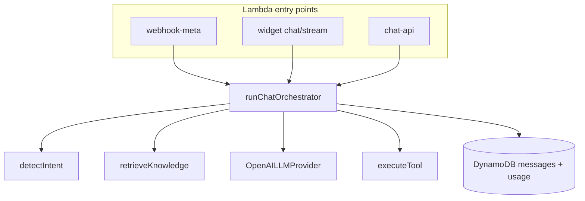

# API Implementation Status

**Parent:** [02-api-specification.md](02-api-specification.md)  
**Last updated:** 2026-06-16  
**Local API:** `http://localhost:3001` (real Lambdas + mock fallback)  
**AWS dev API:** `https://fimfx57xwl.execute-api.us-east-1.amazonaws.com`  
**AWS dev admin:** `https://d3g8dfkodwqrza.cloudfront.net`  
**AWS dev widget CDN:** `https://dtm79sin0m5bg.cloudfront.net/widget/v1.js`  
**AWS dev ingest SFN:** `commercechat-dev-ingest`  
**AWS dev vectors:** `commercechat-dev-vectors`

---

## 0. Recent progress

| Date | Milestone |
|------|-----------|
| 2026-06-06 | Initial monorepo: admin UI, auth + tenant Lambdas, mock fallback |
| 2026-06-07 | Auth session flows, onboarding APIs, knowledge source CRUD |
| 2026-06-07 | Knowledge ingest: website crawl, catalog CSV, RAG (`FileVectorStore`) |
| 2026-06-07 | Chat orchestrator: OpenAI, tools, `POST /api/v1/chat` |
| 2026-06-07 | Usage, conversations, widget APIs + API key auth |
| 2026-06-07 | Dashboard stats (live DynamoDB counts), widget `v1.js` bundle |
| 2026-06-07 | Widget message formatting (bold, lists, line breaks) + product action chips |
| 2026-06-08 | WhatsApp OAuth via ngrok, WABA discovery, dev token connect |
| 2026-06-10 | Team list/invite, logo upload, FAQ ingest, commerce products APIs + admin UI |
| 2026-06-10 | `POST /auth/accept-invite` + `/accept-invite` UI (team join E2E) |
| 2026-06-10 | Team remove/role APIs, S3 presigned logo via LocalStack |
| 2026-06-10 | Billing plans + usage overview APIs, payment webhook stub (no Stripe) |
| 2026-06-11 | Facebook Messenger OAuth connect, inbound webhook + AI reply, dev connect |
| 2026-06-11 | Meta creds → Secrets Manager (LocalStack), token refresh cron, 24h window policy |
| 2026-06-11 | Hard message quota: atomic `reserveMessageQuota`, channel plan limits, Meta quota auto-reply |
| 2026-06-12 | WooCommerce WordPress connector (plugin + sync + Knowledge UI) |
| 2026-06-12 | AWS serverless deploy: `npm run deploy:aws` → API Gateway + 39 Lambdas + DynamoDB (stack `commercechat-dev`) |
| 2026-06-12 | Admin static deploy: `npm run deploy:admin` → S3 + CloudFront (stack `commercechat-dev-admin`) |
| 2026-06-12 | Deploy IAM preflight, failed-stack cleanup, managed-policy attach docs |
| 2026-06-14 | Plan limits: message quota, vector cap, suspended-tenant enforcement (widget/Meta/chat) |
| 2026-06-14 | Billing lifecycle cron (`runBillingLifecycle`), cancel/reactivate APIs, trial/cancel emails |
| 2026-06-14 | Widget SSE `POST /api/v1/widget/chat/stream`, typing events, plan-based rate limits |
| 2026-06-14 | Rich product cards (carousel) in widget; conversation ingest UI (page-voice, Pro+ gate) |
| 2026-06-14 | AWS: Step Functions ingest, EventBridge crons, `deploy:aws:full`, `ensure-deploy-iam` |
| 2026-06-14 | E2E script `apps/api/scripts/test-billing-limits.mjs` (11 checks on dev API) |
| 2026-06-15 | Widget CDN: `commercechat-dev-widget` CloudFront, `WIDGET_CDN_URL`, embed uses CDN |
| 2026-06-15 | S3 Vectors on AWS: catalog CSV → data S3 bucket → ingest worker → `commercechat-dev-vectors` |
| 2026-06-15 | E2E `apps/api/scripts/test-s3-vectors-ingest.mjs` (FAQ sync + catalog pipeline, 5/5 on dev) |
| 2026-06-15 | **Analytics:** `GET /api/v1/analytics` + admin `/analytics` charts (messages, channels, intents, funnel) |
| 2026-06-15 | **80% quota emails:** `maybeSendMessageQuotaWarning` via SMTP on `reserveMessageQuota` |
| 2026-06-15 | **Website crawl S3:** `website/{tenantId}/{sourceId}/crawl.json` in data bucket |
| 2026-06-15 | **WordPress CDN:** `widgetScriptUrl` on register-cloud + bootstrap fallback in plugin |
| 2026-06-16 | **Shopify connector:** OAuth app on Lambda (`/shopify-app/*`), product sync, widget ScriptTag, admin Knowledge + onboarding UI with widget API key |

**Git (local `main`):** Shopify serverless app, commerce APIs, admin connect cards.

---

## 0b. Architecture diagrams

### Chat orchestration (shipped)

See [03-chat-orchestration.md](../functions/03-chat-orchestration.md) for full spec. Core entry: `packages/core/src/chat/orchestrator.ts`.



### Platform context

See [00-MASTER-ARCHITECTURE.md](../00-MASTER-ARCHITECTURE.md) §4–7 for system context, inbound sequence, and ingest flow diagrams.

---

## 1. Summary

| Category | Count |
|----------|------:|
| **Implemented** (real Lambda + DynamoDB) | **~85 routes** |
| **Mock only** (UI works; fixture data) | **0 routes** |
| **Not started** (no handler, no mock) | 5+ routes |
| **Phase 2** (MFA, payment gateway, custom domains) | 4+ routes |

The admin UI calls all endpoints over HTTP. The local dev server routes matching paths to Lambda handlers; everything else falls through to `@commercechat/mock-api`.

**Widget bundle:** `GET /widget/v1.js` served from `apps/widget/public/v1.js` (not counted as API route).  
**Widget demo:** `http://localhost:3001/widget/demo.html?key=pk_live_...` (must be HTTP, not `file://`).

---

## 2. Implemented (real)

| Method | Route | Handler | UI connected |
|--------|-------|---------|:------------:|
| `GET` | `/health` | `health` | — |
| `POST` | `/auth/signup` | `auth-signup` | Yes |
| `POST` | `/auth/login` | `auth-login` | Yes |
| `GET` | `/auth/me` | `auth-me` | Yes |
| `POST` | `/auth/verify-email` | `auth-verify-email` | Yes |
| `POST` | `/auth/refresh` | `auth-refresh` | Yes |
| `POST` | `/auth/logout` | `auth-logout` | Yes |
| `POST` | `/auth/forgot-password` | `auth-forgot-password` | Yes |
| `POST` | `/auth/reset-password` | `auth-reset-password` | Yes |
| `POST` | `/auth/resend-verification` | `auth-resend-verification` | Yes |
| `POST` | `/auth/invite` | `auth-invite` | Yes |
| `POST` | `/auth/accept-invite` | `auth-accept-invite` | Yes |
| `GET` | `/api/v1/tenants/me` | `tenant-me` | Yes |
| `PATCH` | `/api/v1/tenants/me` | `tenant-me` | Yes |
| `POST` | `/api/v1/tenants/me/logo` | `tenant-logo` | Yes |
| `POST` | `/api/v1/tenants/me/logo/presign` | `tenant-logo-presign` | Yes |
| `POST` | `/api/v1/tenants/me/logo/complete` | `tenant-logo-complete` | Yes |
| `GET` | `/api/v1/tenants/me/config` | `tenant-config` | Yes |
| `PATCH` | `/api/v1/tenants/me/config` | `tenant-config` | Yes |
| `GET` | `/api/v1/tenants/me/limits` | `tenant-limits` | Yes |
| `GET` | `/api/v1/tenants/me/usage` | `tenant-usage` | Yes |
| `POST` | `/api/v1/tenants/me/widget/regenerate-key` | `tenant-widget-key` | Yes |
| `GET` | `/api/v1/onboarding` | `onboarding` | Yes |
| `PATCH` | `/api/v1/onboarding/step` | `onboarding` | Yes |
| `POST` | `/api/v1/onboarding/test-chat` | `onboarding-test-chat` | Yes |
| `GET` | `/api/v1/knowledge/sources` | `knowledge-sources` | Yes |
| `POST` | `/api/v1/knowledge/sources` | `knowledge-sources` | Yes |
| `DELETE` | `/api/v1/knowledge/sources/{sourceId}` | `knowledge-sources` | Yes |
| `POST` | `/api/v1/knowledge/sources/{sourceId}/sync` | `knowledge-sync` | Yes |
| `GET` | `/api/v1/knowledge/jobs` | `knowledge-jobs` | Yes |
| `GET` | `/api/v1/knowledge/jobs/{jobId}` | `knowledge-jobs` | Yes |
| `POST` | `/api/v1/knowledge/faq` | `knowledge-faq` | Yes |
| `GET` | `/api/v1/commerce/products` | `commerce-products` | Yes |
| `GET` | `/api/v1/commerce/wordpress/status` | `commerce-wordpress` | Yes |
| `POST` | `/api/v1/commerce/wordpress/connect` | `commerce-wordpress` | Yes |
| `POST` | `/api/v1/commerce/wordpress/sync` | `commerce-wordpress` | Yes |
| `DELETE` | `/api/v1/commerce/wordpress` | `commerce-wordpress` | Yes |
| `GET` | `/api/v1/commerce/wordpress/widget-bootstrap` | `commerce-wordpress` | Yes |
| `GET` | `/api/v1/commerce/shopify/status` | `commerce-shopify` | Yes |
| `POST` | `/api/v1/commerce/shopify/connect` | `commerce-shopify` | Yes |
| `POST` | `/api/v1/commerce/shopify/connect-store` | `commerce-shopify` | Yes (Shopify app) |
| `POST` | `/api/v1/commerce/shopify/sync` | `commerce-shopify` | Yes |
| `DELETE` | `/api/v1/commerce/shopify` | `commerce-shopify` | Yes |
| `GET` | `/api/v1/commerce/shopify/widget-bootstrap` | `commerce-shopify` | Yes (widget) |
| `GET/POST` | `/shopify-app/*` | `shopify-app` | Yes (OAuth + connect UI) |
| `GET` | `/api/v1/team` | `team` | Yes |
| `PATCH` | `/api/v1/team/{userId}` | `team-member` | Yes |
| `DELETE` | `/api/v1/team/{userId}` | `team-member` | Yes |
| `POST` | `/api/v1/chat` | `chat-api` | Yes |
| `GET` | `/api/v1/conversations` | `conversations` | Yes |
| `GET` | `/api/v1/conversations/{id}` | `conversations` | Yes |
| `GET` | `/api/v1/conversations/{id}/messages` | `conversations` | Yes |
| `GET` | `/api/v1/widget/config` | `widget` | Yes |
| `POST` | `/api/v1/widget/chat` | `widget` | Yes (embed) |
| `POST` | `/api/v1/widget/chat/stream` | `widget` | Yes (embed SSE) |
| `GET` | `/api/v1/dashboard/stats` | `dashboard-stats` | Yes |
| `GET` | `/api/v1/analytics` | `analytics` | Yes |
| `GET` | `/api/v1/channels` | `channels` | Yes |
| `POST` | `/api/v1/channels/meta/connect` | `channels-meta-connect` | Yes |
| `POST` | `/api/v1/channels/meta/connect-messenger` | `channels-meta-connect-messenger` | Yes |
| `POST` | `/api/v1/channels/meta/connect-instagram` | `channels-meta-connect-instagram` | Yes |
| `POST` | `/api/v1/channels/meta/connect-dev` | `channels-meta-connect-dev` | Yes |
| `POST` | `/api/v1/channels/meta/connect-messenger-dev` | `channels-meta-connect-messenger-dev` | Yes |
| `GET` | `/api/v1/channels/meta/dev-status` | `channels-meta-dev-status` | Yes |
| `DELETE` | `/api/v1/channels/meta/{channel}` | `channels-meta-disconnect` | Yes |
| `GET` | `/api/v1/channels/meta/health` | `channels-meta-health` | Yes |
| `GET` | `/api/v1/billing/plans` | `billing` | Yes |
| `GET` | `/api/v1/billing/subscription` | `billing` | Yes |
| `GET` | `/api/v1/billing/overview` | `billing` | Yes |
| `POST` | `/api/v1/billing/checkout` | `billing` | Yes |
| `POST` | `/api/v1/billing/cancel` | `billing` | Yes |
| `POST` | `/api/v1/billing/reactivate` | `billing` | Yes |
| `POST` | `/webhooks/payment` | `webhook-payment` | — |
| `GET` | `/webhooks/meta` | `webhooks-meta` | — |
| `POST` | `/webhooks/meta` | `webhooks-meta` | — |
| `POST` | `/internal/cron/billing-lifecycle` | `cron-billing-lifecycle` | — (EventBridge daily) |
| `POST` | `/internal/cron/meta-token-refresh` | `cron-meta-token-refresh` | — (EventBridge daily) |

**Knowledge (page-voice / conversation ingest):** `GET/PATCH /api/v1/knowledge/page-voice`, upload, sync, export — Pro+ plan gate in admin UI.

**Also built (not a route):**
- `jwt-authorizer` — API Gateway authorizer; Bearer in handlers locally
- Chat orchestrator — `packages/core/src/chat/`
- Messenger inbound/outbound — `packages/core/src/meta/messenger-*.ts`, `process-messenger-inbound.ts`
- Meta credentials — Secrets Manager `commercechat/{tenantId}/meta/{whatsapp|messenger}` when `META_SECRETS_USE_SECRETS_MANAGER=true`; else `.data/meta/*.json`
- Meta token refresh — EventBridge `cron(0 3 * * ? *)` UTC + optional `POST /internal/cron/meta-token-refresh`
- Billing lifecycle — EventBridge `cron(0 6 * * ? *)` UTC; trial expiry, cancel-at-period-end, SMTP emails; HTTP requires `x-cron-secret`
- Plan enforcement — `reserveMessageQuota`, `assertVectorQuota`, `assertTenantOperational` (suspended tenants blocked)
- **80% message quota email** — `packages/core/src/billing/quota-email.ts` (once per `USAGE#{period}`)
- **Conversation analytics** — `packages/core/src/analytics/service.ts` (DynamoDB aggregates)
- **Website crawl persistence** — `packages/core/src/ingest/storage/website-crawl-file.ts`
- Widget embed — `apps/widget/public/v1.js` at `/widget/v1.js` (shadow DOM, SSE stream, product carousel, plan rate limits)
- Embed snippet — `buildWidgetEmbedCode()` uses `API_PUBLIC_URL` (Settings → API keys)
- 24h messaging window — enforced on WhatsApp/Messenger/Instagram outbound sends
- Logo storage — S3 presigned upload (`POST .../logo/presign` + `complete`) via LocalStack; local filesystem fallback when `S3_BUCKET` unset
- Ingest pipeline (AWS) — SQS + Step Functions `commercechat-{env}-ingest` when deployed with `--with-ingest-step-functions`
- **Shopify app** — `apps/api/src/shopify-app/` (cookieless OAuth, DynamoDB sessions); Partner credentials `SHOPIFY_API_KEY` / `SHOPIFY_API_SECRET`

**Code locations:**
- Handlers: `apps/api/src/handlers/`
- Business logic: `packages/core/src/`
- UI route list: `apps/admin/src/lib/api/implemented.ts`

---

## 3. Mock only (next to replace)

_None — all admin screens use real handlers locally._

---

## 4. Not started (no mock, no Lambda)

### MVP — remaining

_None — core auth + team invite flow complete._

### Phase 2

MFA (TOTP + email OTP), full payment gateway adapter (Sri Lankan provider — Stripe deferred), custom domains (`api.*`, `app.*`), vector quota warning emails, analytics rollups/GSI (optional perf).

---

## 5. Recommended build order

### Near term (highest impact)

| Priority | Item | Why |
|----------|------|-----|
| 1 | **Payment gateway** | Checkout stub exists; wire Sri Lankan provider + `POST /webhooks/payment` for paid plans |
| 2 | **Meta production** | Custom domain for webhooks/OAuth; submit App Review for WhatsApp live |
| 3 | **Instagram DM E2E** | Handler + OAuth shipped; validate on AWS dev with real IG test account |
| 4 | **CI/CD** | GitHub Actions → `deploy:aws:full` + `deploy:admin` on merge to `main` |
| 5 | **Custom domains** | `api.commercechat.com`, `app.*`, `cdn.*` — ACM + Route 53 |

### Medium term

| Item | Notes |
|------|-------|
| **MFA** | TOTP + email OTP per [13-custom-auth.md](../functions/13-custom-auth.md) |
| **Vector quota email** | Mirror 80% message warning for vector/ingest limits |
| **Analytics perf** | Daily rollup items or GSI if scan volume grows |
| **WAF + budgets** | Pre-launch hardening per [aws-serverless-deployment.md](../../infra/aws-serverless-deployment.md) |
| **SQS chat orchestrator** | Async inbound/outbound queues (spec in chat orchestration doc) |

### Already done (remove from backlog)

- Widget SSE streaming, rich product cards, plan rate limits
- Billing lifecycle cron + suspend enforcement
- Step Functions ingest deploy automation
- Conversation ingest admin UI (page-voice)
- Widget CDN (`commercechat-dev-widget` CloudFront + `WIDGET_CDN_URL`)
- S3 Vectors on AWS (`commercechat-dev-vectors`, catalog → S3 data bucket → ingest worker)
- **Analytics** — `GET /api/v1/analytics` + admin `/analytics` page
- **80% quota warning emails** — SMTP/Resend via `sendRawEmail`
- **Website crawl on AWS** — `crawl.json` in data S3 bucket
- **WordPress plugin CDN** — `widgetScriptUrl` from register-cloud / widget-bootstrap

---

## 6. UI ↔ API matrix

| Admin screen | Live API | Mock fallback |
|--------------|----------|---------------|
| Auth, profile, onboarding, knowledge | Yes | — |
| Team list, invite, remove, role change, accept invite | Yes | — |
| Logo upload — S3 presign (onboarding profile) | Yes | — |
| FAQ quick-add, catalog products (knowledge page) | Yes | — |
| Bot config + test simulator | Config + chat orchestrator | — |
| Usage, billing, dashboard | Usage overview, billing plans/checkout/cancel/reactivate | — |
| **Analytics** | `GET /api/v1/analytics` (date range, funnel, channels) | — |
| Knowledge (page-voice) | Pro+ conversation ingest, export JSON | — |
| Conversations | List, thread, messages | — |
| Widget / API keys | Config, regen-key, embed snippet | — |
| Channels | WhatsApp + Messenger + Instagram connect/disconnect/health, Meta webhooks | — |

---

## 7. AWS dev deploy

```bash
# Recommended: IAM + ingest pipeline + Step Functions + EventBridge crons
npm run deploy:aws:full -- --credentials-csv="..." --env=dev --region=us-east-1 \
  --openai-api-key="$OPENAI_API_KEY" --meta-app-id="$META_APP_ID" \
  --meta-app-secret="$META_APP_SECRET" --meta-verify-token="$META_VERIFY_TOKEN" \
  --app-url=https://d3g8dfkodwqrza.cloudfront.net

npm run deploy:admin -- --credentials-csv="..." --env=dev \
  --api-url=https://fimfx57xwl.execute-api.us-east-1.amazonaws.com
```

IAM only: `npm run ensure:deploy-iam -- --credentials-csv="..."`  
Preflight only: `npm run deploy:aws -- --preflight-only --credentials-csv="..."`  
Retry after failed stack: add `--delete-failed-stack`.  
Skip crons: `--no-cron-schedules`.

**Verify billing cron (Lambda invoke, not HTTP):**

```bash
aws lambda invoke --function-name commercechat-dev-cron-billing-lifecycle \
  --cli-binary-format raw-in-base64-out \
  --payload '{"source":"aws.events","detail-type":"Scheduled Event"}' /tmp/out.json && cat /tmp/out.json
```

**E2E on dev:**

```bash
node apps/api/scripts/test-billing-limits.mjs
```

Inventories: `infra/deployments/`. Guide: [infra/aws-serverless-deployment.md](../../infra/aws-serverless-deployment.md).

---

## 8. Local dev checklist

```bash
docker compose up -d          # LocalStack: DynamoDB + S3 (commercechat-assets)
# Data persists in Docker volume `localstack-data` across stop/start/restart.
# Avoid `docker compose down -v` unless you want to wipe local dev data.
cp apps/api/.env.example apps/api/.env
# Optional in apps/api/.env — S3 logo presign + Zoho SMTP (see .env.example)
npm run dev                   # API :3001 + Admin :3000
```

**S3 logos (LocalStack):** With `S3_BUCKET=commercechat-assets` set, logos upload via presigned PUT to  
`http://localhost:4566/commercechat-assets/logos/{tenantId}.{ext}`. Bucket + CORS are created by  
`scripts/localstack-init/02-create-s3-bucket.sh` on container start.

**Widget demo:** Regenerate API key in Settings → API keys, then open  
`http://localhost:3001/widget/demo.html?key=pk_live_...` while `npm run dev` is running.

**Meta Messenger (local):**

```bash
npm run dev:ngrok:ui          # tunnel :3000 — admin + /webhooks/* proxy to API :3001
```

1. Meta app → **Messenger** → connect Page; **Webhooks** → callback  
   `https://<ngrok>.ngrok-free.dev/webhooks/meta`, verify token = `META_VERIFY_TOKEN`
2. Subscribe **Page** object fields: `messages`, `messaging_postbacks` (required — without these, DMs never reach the API)
3. Whitelist OAuth redirect: `https://<ngrok>.ngrok-free.dev/channels/meta/callback`
4. Admin → **Channels** → Connect Messenger; DM the Page from Facebook Messenger
5. Confirm API log `[messenger] replied to …` and thread under **Conversations → messenger**

**Test scripts:**
```bash
cd apps/api && node scripts/test-dashboard-widget.mjs
cd apps/api && node scripts/test-chat.mjs
cd apps/api && node scripts/test-usage-widget-conversations.mjs
cd apps/api && node scripts/test-billing-limits.mjs
cd apps/api && node scripts/test-s3-vectors-ingest.mjs   # S3 Vectors + ingest pipeline on dev
```
