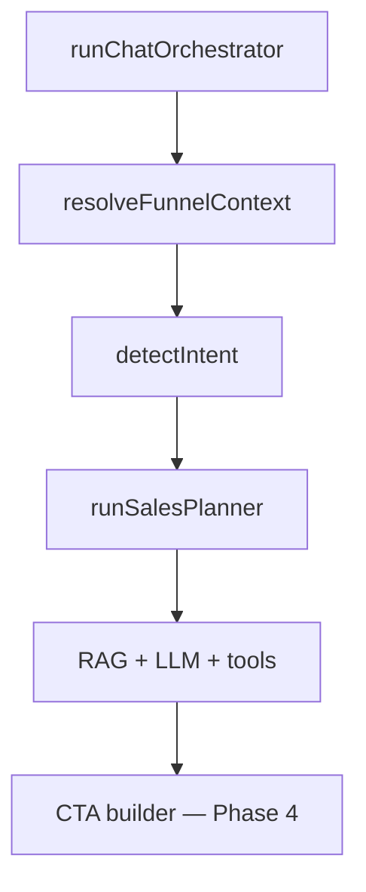

# Chat Quality Roadmap (Phases 1–5)

**Parent:** [03-chat-orchestration.md](../functions/03-chat-orchestration.md)  
**Implementation:** `packages/core/src/chat/`  
**Last updated:** 2026-06-25  
**Status:** Phases 1–5 shipped locally · Phases 1–4 deployed to AWS dev 2026-06-16 · Phase 5 API deployed in dev during sales-planner iteration

---

## 1. Overview

CommerceChat uses a **single orchestrator** (`runChatOrchestrator`) — not separate qualifier / recommender / closer microservices. Sales-funnel behavior is layered via:

| Logical role | Implementation |
|--------------|----------------|
| Qualifier | `funnelStage` + `qualification` slots + prompt hints |
| Sales planner | `sales-planner.ts` low-temperature JSON call for search query, missing slot, language style, reset/recovery plan |
| Recommender | `search_products`, `compare_products`, `get_related_products` |
| Closer | Stage CTAs + `add_to_cart` + `create_checkout_link` + widget actions |

Human **handoff** (`handlingMode: human`) is separate from the sales funnel.



---

## 2. Phase 1 — Shipped

| Area | Changes |
|------|---------|
| Prompts | Anti-hallucination rules, intent hints, RAG 800 chars, `pageUrl` |
| Intent | `messageMentionsProducts()`, broader RAG for mixed FAQ+product |
| Tools | Merge cache+vector hits; `getProductBySku` for prices |
| Reply | `product-reply.ts` — enrich reply after search |
| Orchestrator | Tenant `temperature` / `maxOutputTokens`, post-hoc search sync |
| Eval | `apps/api/scripts/eval-chat.mjs` smoke tests |

---

## 3. Phase 2 — Session / funnel state

**Goal:** Persist shopper journey stage and use it for prompts, tools, and analytics.

### 3.1 Data model

On `ConversationState` (DynamoDB `CONV#` item):

```typescript
type FunnelStage = "discover" | "compare" | "objection" | "cart" | "checkout";

interface QualificationState {
  budget?: { min?: number; max?: number };
  category?: string;
  recipient?: string;
  quantity?: number;
  constraints?: string[];
  removeConstraints?: string[];
  objectionsRaised?: string[];
  lastComparedSkus?: string[];
}
```

Default new conversations → `funnelStage: "discover"`.

### 3.2 Transition rules (`packages/core/src/chat/funnel.ts`)

| Signal | Stage |
|--------|-------|
| Greeting / vague browse | `discover` |
| Product intent or product keywords | `compare` |
| Objection keywords (price, shipping, trust) | `objection` |
| Cart has items | `cart` |
| Checkout intent + cart | `checkout` |
| New product search after checkout | `compare` |

Rules-first (same style as `intent.ts`). Optional LLM refinement deferred to Phase 3b.

### 3.3 Deliverables

| # | Task | Status |
|---|------|--------|
| 2a | Types, `funnel.ts`, orchestrator + prompt wiring | **Shipped** |
| 2b | Admin funnel badge on conversation detail | **Shipped** |
| 2c | Analytics `funnelStageBreakdown` from message metadata | **Shipped** |

### 3.4 Acceptance criteria

- Funnel stage visible on conversation in admin
- Stage stored on outbound message metadata
- Analytics counts per stage

---

## 4. Phase 3 — Qualification & sub-intents

**Goal:** Finer routing without replacing top-level `ChatIntent` (still drives model selection).

### 4.1 Sub-intents

```typescript
type ChatSubIntent =
  | "product_browse"
  | "product_compare"
  | "product_detail"
  | "faq_policy"
  | "faq_objection"
  | "cart_review"
  | "checkout_ready"
  | "order_status";
```

`detectSubIntent(message, intent, funnelStage, qualification)` in `intent.ts`.

### 4.2 Qualification extractor

- Rules: budget regex, category from catalog
- Optional nano LLM JSON extract (env-gated)
- At most **one** qualifying question per turn in `discover`

### 4.3 Objection-tagged FAQ

- FAQ chunk metadata: `tags: ["objection:price", "objection:shipping"]`
- Boost matching chunks when `funnelStage === "objection"`

### 4.4 Acceptance criteria

- [x] Sub-intent on message metadata
- [x] Qualification slots merged on conversation (`budget`, `category`, `recipient`, `objectionsRaised`)
- [x] Objection FAQ boost when chunks have `tags: ["objection:…"]`
- [ ] Objection FAQ hit rate ≥ 60% on eval set (when tags seeded)

### 4.5 Deliverables

| # | Task | Status |
|---|------|--------|
| 3a | `detectSubIntent`, qualification extract/merge, prompt + tool wiring | **Shipped** |
| 3b | FAQ `tags` in ingest + RAG objection boost | **Shipped** |
| 3c | Admin qualification display | **Shipped** |

---

## 5. Phase 4 — Sales tools, CTAs, widget, eval

### 5.1 New tools

| Tool | Purpose |
|------|---------|
| `compare_products` | Diff 2–4 SKUs (price, stock, attributes) |
| `get_related_products` | Same category; exclude cart / compared SKUs |

### 5.2 Proactive CTAs (`cta.ts`)

Stage-driven `suggestedActions` on every reply:

| Stage | Examples |
|-------|----------|
| `discover` | "Show best sellers" |
| `compare` | "Add [SKU] to cart" |
| `objection` | "View return policy" |
| `cart` | "Checkout now" |
| `checkout` | "Get checkout link" |

### 5.3 Widget actions

Extend `WidgetAction` with `action: "view" | "add_to_cart" | "checkout"`.

- `POST /api/v1/widget/cart` for idempotent add-to-cart (no LLM)
- Product card **Add to cart** button (today chips only send "Tell me more…")

### 5.5 Deliverables

| # | Task | Status |
|---|------|--------|
| 4a | `compare_products`, `get_related_products` | **Shipped** |
| 4b | `cta.ts` + orchestrator `suggestedActions` | **Shipped** |
| 4c | `POST /api/v1/widget/cart` + widget buttons | **Shipped** |
| 4d | Eval suite `cases.json` + `npm run eval:chat` | **Shipped** |

### 5.6 Acceptance criteria

- [x] Compare/related tools registered and gated by sub-intent
- [x] Every bot reply includes stage-appropriate CTAs (web)
- [x] Widget add-to-cart calls cart API directly
- [x] Eval pass rate ≥ 85% on dev API — **6/6 (100%)** on 2026-06-16

### 5.7 Deploy & verification (2026-06-16)

| Target | Result |
|--------|--------|
| API | `npm run deploy:aws` → `commercechat-dev-2026-06-16T20-05-02-022Z.json` |
| Admin | `npm run deploy:admin` |
| Widget CDN | `npm run deploy:widget` → invalidation `20-05-35` |

```bash
API_URL=https://fimfx57xwl.execute-api.us-east-1.amazonaws.com \
WIDGET_API_KEY=pk_live_... \
npm run eval:chat
```

Widget chat response includes `funnelStage`, `subIntent`, `suggestedActions` (with `action`: `view` \| `add_to_cart` \| `checkout`). Cart API returns `400 Product not found` for invalid SKU (expected).

---

## 6. Phase 5 — Agentic sales planner & tenant catalog intelligence

**Goal:** Keep the deterministic orchestrator, but add a structured LLM planning layer so natural language, Singlish/Sinhala terms, topic changes, and recovery paths are handled before product search.

### 6.1 LLM call structure

There are now two LLM calls in product-like turns:

| Call | File | Purpose | Output |
|------|------|---------|--------|
| Sales planner | `packages/core/src/chat/sales-planner.ts` | Parse latest message + recent history + existing qualification + catalog hints into structured sales state | Compact JSON `SalesPlan` |
| Main chat | `packages/core/src/chat/orchestrator.ts` + `prompts.ts` | Produce the customer-facing answer or tool calls using RAG, cart, tools, and qualification | Assistant text + optional `tool_calls` |

Planner prompt location: `runSalesPlanner()` system message in `packages/core/src/chat/sales-planner.ts`.

Main prompt location: `buildSystemPrompt()` in `packages/core/src/chat/prompts.ts`; tenant base prompt comes from `config.prompts.systemPrompt`.

### 6.2 `SalesPlan` schema

```typescript
interface SalesPlan {
  confidence?: number;
  languageStyle?: "english" | "sinhala" | "tamil" | "singlish" | "mixed" | "unknown";
  intent?: "product_search" | "gift" | "event" | "faq" | "checkout" | "unknown";
  searchQuery?: string;
  missingSlot?: "budget" | "recipient" | "use_case" | "style" | "quantity" | "none";
  resetContext?: boolean;
  productType?: string;
  material?: string;
  occasion?: string;
  recipient?: string;
  useCase?: string;
  style?: string;
  quantity?: number;
  budget?: { min?: number; max?: number };
  availabilityQuestion?: boolean;
  nextQuestion?: string;
  replyTone?: "concise" | "consultative" | "premium" | "friendly";
  recoveryActions?: Array<{ label: string; message: string; strategy?: string }>;
}
```

The public chat response includes `salesPlan` for eval/debug visibility: `trusted`, `confidence`, `languageStyle`, `searchQuery`, `missingSlot`, slot values, and recovery actions.

### 6.3 Guardrails

- Planner output is trusted only above `PLANNER_CONFIDENCE_THRESHOLD`.
- Planner slot values are persisted only when grounded in the latest user message or a tenant catalog alias.
- Budget from the planner is only accepted when the latest message actually contains budget/price-tier language.
- Explicit new item requests such as `show me silver elephant` reset stale qualification context instead of carrying old filters into the intro/search.
- Uncertainty replies such as `no idea`, `not sure`, and `don't know` are not stored as constraints.

### 6.4 Tenant catalog hints

`listCatalogSearchHints()` now returns:

- `priceBandsByCategory`
- `priceBandsByMaterial`
- `aliases`
- `occasionRecipients`
- existing categories, tags, materials, recipients, occasions, use cases, styles, and global price bands

Current alias examples are generated only when supported by the tenant catalog:

| Alias | Target |
|-------|--------|
| `piththala`, `pittala`, `පිත්තල` | `Brass` |
| `pahan`, `pahana`, `පහන්`, `පහන` | `Oil Lamp` |
| `ridi`, `ridiya`, `රිදී` | `Silver` |
| `aliya`, `aliyaa`, `අලියා` | `Elephant` |

### 6.5 Sales recovery and smart CTAs

- `cta.ts` prefers planner-provided recovery actions for empty/weak result paths.
- If no planner recovery exists, deterministic recovery actions relax the latest constraint, broaden product type, or offer premium alternatives.
- Budget actions use category/material-specific price bands when possible before falling back to global tenant price bands.
- Engagement questions use result quality and product diversity to avoid unrelated generic questions.

### 6.6 Eval visibility

`apps/api/scripts/eval-chat/run.mjs` logs `salesPlan` fields per case. Assertions support:

- `salesPlanTrusted`
- `salesPlanSearchIncludes`

### 6.7 Acceptance criteria

- [x] `salesPlan` returned in chat result for debugging/evals
- [x] Planner search query used for RAG/product search when trusted
- [x] Planner missing slot can override discovery question
- [x] Planner recovery actions can become widget CTAs
- [x] Context reset prevents stale filters after explicit topic changes
- [x] Uncertainty phrases do not become constraints
- [x] Singlish/Sinhala aliases improve searches like `piththala pahan`, `ridi aliya`

---

## 7. Optional — OpenAI Agents SDK

**When:** After Phase 4 if tool rounds often hit `MAX_TOOL_ROUNDS` (3) or tool count > 6.

- Keep outer shell: quota, funnel, persist, widget envelope
- Replace inner LLM tool loop only
- Feature flag `LLM_AGENT_LOOP` per tenant
- **Not** AgentKit hosted (Builder sunsetting Nov 2026)

---

## 8. Build order

| Sprint | Deliverable |
|--------|-------------|
| 2a | Funnel types + transitions + orchestrator + prompts |
| 2b | Admin badge + analytics breakdown |
| 3a | Sub-intents + qualification slots |
| 3b | Objection FAQ tags in RAG |
| 4a | `compare_products`, `get_related_products` |
| 4b | CTA builder |
| 4c | Widget add-to-cart + cart API |
| 4d | Eval suite + CI |
| 5a | Sales planner JSON call |
| 5b | Planner confidence/grounding + context reset |
| 5c | Tenant aliases + contextual price bands |
| 5d | Planner/eval visibility |

**Estimate:** 4–6 weeks focused work.

---

## 9. Success metrics

| Phase | Metric |
|-------|--------|
| 2 | Product conversations reach `compare` or `cart` within 5 turns (eval sample) |
| 3 | ≤ 1 redundant qualify question; objection FAQ hits when tagged |
| 4 | Widget add-to-cart success ≥ 95%; eval pass ≥ 85% |
| 5 | Fewer stale-context recommendations; planner trusted/search query assertions pass for multilingual catalog cases |

---

## 10. Key files

| File | Role |
|------|------|
| `packages/core/src/chat/orchestrator.ts` | Entry point |
| `packages/core/src/chat/funnel.ts` | Stage transitions |
| `packages/core/src/chat/intent.ts` | Intent + (Phase 3) sub-intent |
| `packages/core/src/chat/prompts.ts` | System prompt + funnel hints |
| `packages/core/src/chat/sales-planner.ts` | Structured JSON sales planner prompt + helpers |
| `packages/core/src/chat/tools.ts` | Commerce tools |
| `packages/core/src/chat/cta.ts` | Phase 4 suggested actions |
| `packages/shared/src/types.ts` | Shared funnel types |
| `packages/core/src/chat/qualification.ts` | Budget/category/recipient slots |
| `packages/core/src/chat/rag-boost.ts` | Objection FAQ tag boost |
| `apps/api/scripts/eval-chat/` | Golden cases + `npm run eval:chat` |
