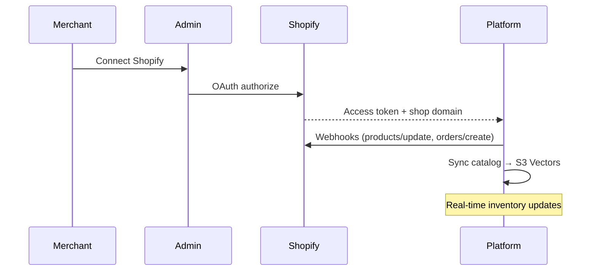

# Phase 3 — Scale

**Parent:** [00-MASTER-ARCHITECTURE.md](../00-MASTER-ARCHITECTURE.md)  
**Duration:** 8–12 weeks (after Growth)  
**Goal:** Commerce platform integrations, enterprise features, operational scale to 500+ merchants.

---

## 1. Phase objectives

| # | Objective | Success criteria |
|---|-----------|------------------|
| 1 | Shopify integration live | OAuth app; catalog sync via ingest pipeline (**shipped**) |
| 2 | Human handoff | Agent can take over conversation |
| 3 | Enterprise tier | SSO, dedicated support, custom SLA |
| 4 | Operational scale | 500 merchants, 1M messages/month |
| 5 | Advanced RAG | Multimodal social; re-ranker; premium embeddings |
| 6 | WhatsApp Commerce | Catalog + native product messages |

---

## 2. Scope additions

| Function | Phase 3 additions |
|----------|-------------------|
| [06 E-commerce Tools](../functions/06-ecommerce-tools.md) | Shopify + WooCommerce connectors; WhatsApp catalog |
| [02 Meta Channels](../functions/02-meta-channel-integration.md) | WhatsApp Commerce catalog sync |
| [05 RAG Ingestion](../functions/05-rag-knowledge-ingestion.md) | Social OAuth sync; Cohere multimodal for images; re-ranker |
| [08 Admin Dashboard](../functions/08-admin-dashboard.md) | Human handoff inbox; advanced analytics; SSO |
| [09 Billing](../functions/09-billing-usage.md) | Enterprise plan; usage-based LLM pass-through |
| [10 Security](../functions/10-security-compliance.md) | Per-tenant KMS; SOC 2 prep; annual pen test |
| [11 AWS Infra](../functions/11-aws-infrastructure.md) | Multi-AZ hardening; OpenSearch for conversation search (optional) |

---

## 3. Deliverables

| Deliverable | Priority |
|-------------|----------|
| Shopify OAuth app + catalog sync | P0 |
| WooCommerce connector | P1 |
| Human handoff (admin takeover) | P0 |
| WhatsApp product catalog | P1 |
| Cross-encoder re-ranker for RAG | P1 |
| Enterprise plan + SAML SSO | P1 |
| Auto-routing (cheapest model per intent with quality guard) | P2 |
| Vision: product image understanding from social | P2 |
| Multi-region deployment (EU) | P2 |
| SOC 2 Type 1 audit start | P2 |
| Public API for merchants | P2 |

---

## 4. Shopify integration



### Synced data

- Products, variants, inventory, collections
- Orders (for status lookup)
- Customer data (minimal — order lookup only)

---

## 5. Human handoff

| State | Behavior |
|-------|----------|
| `bot` | AI handles all messages (default) |
| `handoff_requested` | Customer asked for human; notify merchant |
| `human_active` | AI paused; agent replies from admin |
| `bot` (resumed) | Agent returns control to AI |

### Admin inbox (Phase 3)

- Real-time conversation list with `needs_attention` flag
- Agent can type reply → sent via channel sender
- Conversation notes (internal, not sent to customer)

---

## 6. Enterprise tier

| Feature | Enterprise ($999+/mo) |
|---------|----------------------|
| Messages | 200,000/mo |
| SMS MFA (Twilio) | ✅ |
| SSO (SAML) | Phase 3b |
| Dedicated onboarding | ✅ |
| Custom LLM model selection | ✅ |
| BYOK (bring your own OpenAI key) | ✅ |
| Per-tenant KMS | ✅ |
| SLA 99.9% | ✅ |
| Priority support | ✅ |
| Data residency (EU) | ✅ (Phase 3b) |

---

## 7. RAG upgrades

| Upgrade | Detail |
|---------|--------|
| Re-ranker | Cross-encoder on top 20 candidates → best 5 |
| Premium embeddings | `text-embedding-3-large` for Business+ plans |
| Multimodal | Cohere Embed v4 for Instagram image posts |
| Hybrid search | Keyword (SKU) + vector combined |
| Stale content detection | Auto-deprioritize chunks > 6 months old (social) |

---

## 8. Scale targets

| Metric | Target |
|--------|--------|
| Merchants | 500 |
| Messages/month | 1,000,000 |
| Orchestrator p95 latency | < 5s |
| Uptime | 99.9% |
| Ingest jobs/day | 1,000 |
| Support ticket rate | < 2% of merchants/month |

---

## 9. Infrastructure scaling

| Component | Scale action |
|-----------|--------------|
| Lambda orchestrator | Reserved concurrency 200+ |
| SQS | Multiple queues per region if needed |
| DynamoDB | Monitor hot partitions; consider GSI sharding |
| S3 Vectors | Monitor query latency; split large tenant indexes |
| CloudWatch | Log sampling for high-volume tenants |
| Cost | Per-tenant COGS dashboard; auto-alert on negative margin |

---

## 10. Auto-routing (cost optimization)

```typescript
// Phase 3: quality-gated model routing
if (intent === 'faq' && retrievalConfidence > 0.85) {
  model = 'gpt-4.1-nano';  // cheap
} else if (intent === 'checkout') {
  model = 'gpt-4.1-mini';  // reliable
} else {
  model = 'gpt-4o-mini';   // default
}
```

Guardrail: if cheap model response fails eval heuristics → auto-retry with premium model.

---

## 11. Definition of done

1. Shopify app published in Shopify App Store
2. 10% of merchants use Shopify connector
3. Human handoff used by 25% of Pro+ merchants
4. 500 active merchants
5. Platform handles 1M messages/month without degradation
6. SOC 2 Type 1 audit initiated
7. Gross margin maintained > 55% at scale

---

## 12. Long-term roadmap (post Phase 3)

| Feature | Timeline |
|---------|----------|
| TikTok / Telegram channels | Phase 4 |
| Voice messages (WhatsApp audio) | Phase 4 |
| AI-trained per-merchant fine-tuning | Phase 5 |
| White-label reseller program | Phase 5 |
| On-premise / VPC deploy for enterprise | Phase 5 |
